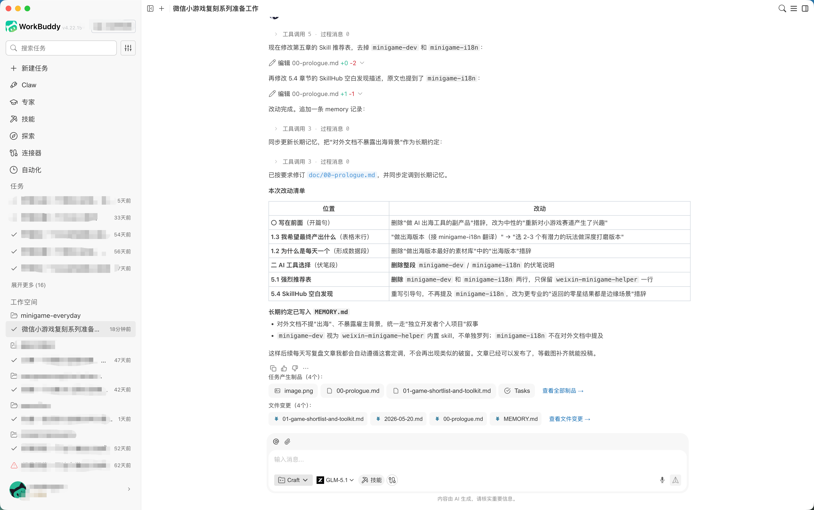
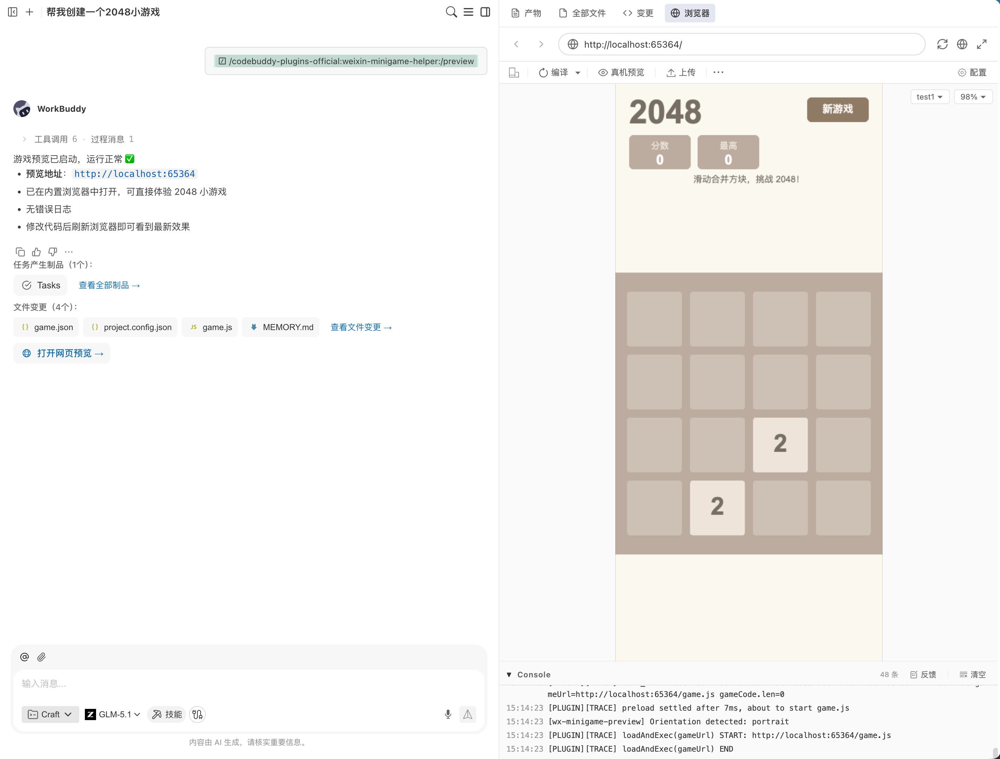

# 每天复刻一个微信小游戏 · 开篇

> 一个独立开发者的 100 天小游戏复刻计划：从选题、调研到落地的完整记录。
>
> 作者：xiaofengguo · 2026-05-20 · 系列 Day 0

---

## 〇 写在前面

最近因为工作的原因一直在关注小游戏赛道，一直在思考AI 和 小游戏的结合方式，现在市面上做应用的很多，但是具体如何做游戏的工具和技能却不多，我个人又想探索下相关的方向。

于是给自己定了个事情：**每天复刻一个微信/抖音小游戏，连续 100 天**。每一天产出一份能跑的代码、一段录屏、一篇复盘。复刻不是抄袭，是把核心循环拆出来，用最短的链路重做一遍——这个过程对于理解一款产品为什么"上头"，比读多少篇分析都更直接。

同时，我也会把整个探索过程和结果分享出来，希望能帮到对此也有兴趣的同学。

这是这个系列的第 0 篇：**起手式**。它要解决两个问题：

1. **选题**——市面上爆款这么多，今天复刻什么？明天又复刻什么？我得先有一份去重之后的清单。
2. **工具链**——AI 时代了，光靠手敲不快。我得先搞清楚 AI 配合哪些工具可以真正帮我我提效。

下面是这两件事的完整记录。

---

## 一 想法描述

### 1.1 为什么是"小游戏"

- **生命周期短、循环清晰**：一款爆款小游戏的核心玩法通常能用一句话讲清楚（"点 3 个一样的就消除"、"按颜色拖到对应槽位"），适合一天搞完。
- **市场反馈极快**：微信小游戏畅销榜每月换血率超过 30%，这意味着每个月都有十几个新的玩法值得拆。
- **成本极低**：一个 H5 引擎 + 几张图就能跑起来，不需要安装、不需要审核到崩溃。
- **AI 友好**：玩法以"规则"为核心，正好是大模型擅长的部分。代码量小、逻辑边界清晰，AI 出错也容易被发现。

### 1.2 为什么是"每天一个"

- **逼迫节奏**：一天的窗口逼着我必须砍掉非核心功能，只复刻"灵魂玩法"。这反而是最有价值的训练。
- **形成数据**：100 天 = 100 份代码 + 100 篇文章 + 100 段录屏。这是后面回头做总结、做开源工具最好的素材库。
- **倒逼工具链**：如果每天都要从零开始，不可能跑得动。所以系列本身也会沉淀出一套可复用的脚手架和 AI 工作流。

### 1.3 我希望最终产出什么

| 维度 | 产出 |
|---|---|
| 代码 | 一个 monorepo，每日一个目录，全部开源到 GitHub |
| 文章 | 每日一篇复盘（核心循环拆解 + AI 协作过程 + 踩坑） |
| 工具 | 系列结束时沉淀一套"AI 复刻小游戏" Skill，上传 SkillHub |
| 副产品 | 选 2-3 个有潜力的玩法做深度打磨版本 |

### 1.4 边界（不做的事）

- ❌ 不抄美术资源，所有图全部用 AI 生图或开源素材
- ❌ 不复刻重度 SLG / MMO（《无尽冬日》这种，1 天根本碰不动核心循环）
- ❌ 不做服务端复杂功能（PvP 实时对战、好友系统等只做 mock）
- ❌ 不上架，只做开源 demo 和文章

---

## 二 AI 工具选择：为什么是 WorkBuddy

这一步本来想跳过的——但既然这是给独立开发者看的探索文档，就把选型的过程也一起写下来。

### 2.1 我真正想要的：一个 Agent，而不是一个 IDE

先说结论，再说对比。我的核心诉求其实只有一句话：

> **我希望整个游戏开发流程尽可能自动化，让 AI 接管"写、跑、截、改、发"的全链路；我自己只在上层沉淀工具和技能（Skill），而不是去当一个被 AI 辅助的程序员。**

这句话决定了我要的不是"一个能写代码的 IDE"，而是"一个能自己跑完一整个开发循环的 Agent"。两者的差别非常本质：

| 维度 | IDE 形态（Cursor / VSCode + 插件） | Agent 形态（WorkBuddy / Claude Code 等） |
|---|---|---|
| 主体 | **人**在写代码，AI 辅助补全/重构 | **AI**在执行任务，人审阅与指挥 |
| 调度 | 人决定下一步做什么 | Agent 自己拆解、规划、调用工具 |
| 沉淀 | 配置和 prompt 散落在各文件里 | 通过 Skill 把工作流封装成可复用资产 |
| 适合 | 单点提效（写得更快） | 流程自动化（少介入） |

我要的是后者。100 天每天都要出活，如果每一步都得我手动盯着、点按钮、切窗口，这件事根本不可持续——我需要的是"提一句话，回来看结果"。

### 2.2 候选方案对比

| 工具 | 形态 | 优点 | 缺点 | 结论 |
|---|---|---|---|---|
| Cursor | IDE | 补全和 inline edit 体验顶级；社区也有微信小游戏相关插件 | **本质是辅助人写代码**，自动化执行链路弱，跑游戏 / 截屏 / 真机这些环节仍需人来串 | 不符合"Agent 优先"的诉求 |
| Claude Code / Codex | Agent（终端） | 终端原生、tool use 强、会自己规划 | 没有内置的小游戏预览/截屏闭环；Skill 沉淀机制偏弱 | 方向对，能力缺一块 |
| ChatGPT + 手动 | 对话 | 灵活 | 上下文断裂、文件操作全靠复制粘贴 | 不在一个量级 |
| **WorkBuddy** | **Agent + IDE 双形态** | 原生 Agent 调度 + Skill 体系（可沉淀工作流）+ 文档/图表/PPT 生成；并且**内置了 `weixin-minigame-helper` 这个针对微信小游戏的闭环插件** | 生态相对新 | **选它** |

### 2.3 决定性因素：Agent + Skill 体系

WorkBuddy 击中我的核心点有两个，按重要性排序：

1. **它本身就是一个 Agent**，不是"一个带 AI 的编辑器"。我提需求，它自己拆步骤、调工具、跑命令、回报结果——我只在关键节点介入。
2. **Skill 体系**让我可以把这 100 天里反复出现的动作（"复刻一个三消"、"接入微信广告 SDK"、"生成关卡配置表"）沉淀成可复用的能力，而不是每天重写 prompt。这正好匹配我"沉淀工具和技能"的目标。

> 简单说：**Cursor 让我写得更快，WorkBuddy 让我可以不用亲自写。** 这是这个系列要的东西。

### 2.4 关键加分项：`weixin-minigame-helper` 插件

需要单独把这个插件拎出来讲——它绝对是**最关键的加分项之一**，没有它，前面说的"Agent 自动化"在小游戏场景下会断在最后一公里。

需要说明的是，Cursor / VSCode 等 IDE 里也有这个微信小游戏插件，在使用 WorkBuddy这个前提下， `weixin-minigame-helper` 是 **WorkBuddy 内置、且围绕 Agent 工具调用（tool use）专门设计的**——也就是说它的每一个能力都能被 Agent 直接当作工具调起，而不是给人点的按钮。

它提供的能力包括：

- `run_game` / `reload_game`：一键启动本地预览、热重载，AI 改完代码自己重启
- 控制台日志读取：AI 改完能自己回头看 log 判断有没有跑挂
- `capture_screenshot`：AI 自己截屏，看到画面后再决定下一步要不要改
- `real_device_preview`：一句话生成真机扫码二维码
- 上传开发版：一句话推到微信公众平台

把它接到 Agent 上，整个闭环就跑通了：

```
我提需求
  → AI 写代码
  → AI 自己 run_game 启动预览
  → AI 自己 capture_screenshot 看效果
  → AI 自己读 console 日志判断有没有报错
  → 不对就改、热重载、再截
  → 我只在"看起来差不多了"的时候介入审一下
```

对于"每天必须出活"的节奏来说，这种闭环带来的速度差是数量级的。所以这个系列就用 WorkBuddy 全程贯穿。




---

## 三 调研过程：和 AI 的真实对话

> 下面是我向 WorkBuddy 提的真实指令，**原文照搬**，以及它的核心产出。中间为了文档可读性，省略了纯执行步骤的日志，只保留了我会回头复用的内容。

### 3.1 我的输入（原文）

```
现在我们准备开始一个实践+文章的系列，每天复刻一个微信小游戏，
为此，我们需要做一些准备：
1. 整理一下目前热度榜等各种榜单的微信/抖音小游戏，按照名称，玩法，
   热度，复刻难度，整理一个表格，完全同类的玩法的游戏只需要保留一个即可。
2. 搜索一下Skill Hub、插件市场有哪些可以辅助快速开发微信小游戏的技能和插件，
   整理下推荐给我。
```

### 3.2 AI 的执行路径

WorkBuddy 接到指令后，自主拆成了几步：

1. **WebSearch** 多轮检索 GameLook、引力引擎 ADX、网易、腾讯新闻等渠道的 **2026 年 4 月微信/抖音小游戏畅销榜 + 畅玩榜**
2. 调用 **SkillHub API** 查询 `lightmake.site` 上有没有现成的微信小游戏开发 Skill
3. 比对 WorkBuddy 自身已安装的内置插件
4. 按"完全同类玩法只保留代表作"原则去重
5. 按"复刻难度"重新排序（因为我的目标是每天一个，这个维度比单纯热度更重要）

整个过程没需要我中途介入——这是我比较意外的，本来以为会卡在"什么叫同类"这个判断上。它的判断标准是：**核心循环是否一致**（比如《消灭星星》《开心水果连连看》《消个水果》在它眼里都是"消除一族"，留代表作）。


### 3.3 主要产出

它最终给了我两份东西：

- 一份 **15 款去重后的复刻清单**（按难度排序）
- 一份 **Skill / 插件推荐清单**

下面分别详细记录。

---

## 四 调研结果一：复刻候选清单

### 4.1 数据来源说明

- **微信小游戏畅销榜 / 畅玩榜**：GameLook + 引力引擎 ADX 2026 年 4 月数据
- **抖音小游戏畅销榜 / 热门榜**：腾讯新闻 + 引力引擎 4 月数据
- **覆盖时间**：截至 2026-05-20（本文撰写时）

### 4.2 筛选原则

1. **聚焦畅玩榜（IAA 休闲向）**——畅销榜 Top 多为重度 SLG，不适合每日复刻，全部排除
2. **同类合并**：消除一族、塔防一族、放置一族、SLG 一族，每族只留一个代表
3. **复刻难度评估三维**：核心循环复杂度 + 美术资源量 + 物理/算法门槛

### 4.3 候选清单（按难度从易到难）

| # | 游戏名 | 平台位置 | 玩法分类 | 核心机制（一句话） | 热度 | 复刻难度 | 备注 |
|---|---|---|---|---|---|---|---|
| 1 | **打个螺丝** | 微信畅玩榜 #4 | 收纳/物理拼图 | 屏幕飘落各种螺丝零件，按颜色或类型拖入对应槽位，槽满即失败 | ★★★★★ | ⭐ 极易 | 尊悦"打螺丝"系列鼻祖，逻辑极简 |
| 2 | **消个水果** | 微信畅玩榜 TOP10 | 三消变体（卡槽收纳） | 点击悬浮水果落入下方 7 槽，相邻同类自动消除，槽满 GG | ★★★★ | ⭐ 极易 | 《羊了个羊》近亲，关卡随机生成 |
| 3 | **一箭又一箭** | 微信畅玩榜 #3 | 物理射击 | 点击蓄力射箭，穿过障碍/苹果/敌人，物理抛物线轨迹 | ★★★★★ | ⭐⭐ 易 | 一根弓 + 物理引擎 |
| 4 | **箭头会拐弯** | 微信畅玩榜 #5 | 路径解谜 | 拖动箭头沿格子路径行进，到达终点；箭头会因地形改变方向 | ★★★★ | ⭐⭐ 易 | 关卡用 grid 数据描述即可 |
| 5 | **羊了个羊：星球** | 微信/抖音畅玩榜 #1 | 三消堆叠 | 三消 + 堆叠层级，下方 7 槽限制，难度梯度极陡 | ★★★★★ | ⭐⭐ 易 | 经典框架，难点在关卡平衡 |
| 6 | **抓大鹅** | 微信/抖音畅玩榜 #2 | 3D 三消收纳 | 三维堆叠物品，点击 3 个相同消除，下方 7 槽限制 | ★★★★★ | ⭐⭐⭐ 中 | 3D 透视摆放是门槛，可降级 2.5D |
| 7 | **快乐拼拼豆** | 微信新晋 TOP30 | 拼豆/像素拼图 | 按图纸往网格里点击对应颜色豆豆 | ★★★ | ⭐⭐ 易 | 网格 + 调色板 |
| 8 | **每天过一关** | 微信新晋 TOP30 | 一日一关合集 | 每天解锁一个全新小关卡 | ★★★ | ⭐⭐⭐ 中 | 系列收尾候选 |
| 9 | **超能下蛋鸭** | 抖音畅销榜 #1 | 放置经营 | 鸭子下蛋，蛋孵化、合成升级、解锁更高产鸭 | ★★★★★ | ⭐⭐⭐ 中 | 数值表是工作量大头 |
| 10 | **疯狂水世界** | 微信/抖音 TOP5 | 模拟经营 | 水上乐园经营，建造、升级、客流管理 | ★★★★ | ⭐⭐⭐ 中 | UI 与状态机较多 |
| 11 | **向僵尸开炮** | 微信畅销 #6 | 塔防 + 割草 | 单指点击布防，技能消僵尸潮 | ★★★★★ | ⭐⭐⭐⭐ 偏难 | 大量怪物 + 子弹粒子，性能优化是关键 |
| 12 | **遗弃之地** | 抖音畅销 #6 | 塔防 SLG | 末日塔防 + 建造防线 | ★★★★ | ⭐⭐⭐⭐ 偏难 | 与 #11 同类，二选一 |
| 13 | **灵画师** | 微信/抖音 TOP10 | 合成放置 | 国风水墨，物品合并构建洞府 | ★★★★ | ⭐⭐⭐ 中 | 合成树设计是工作量 |
| 14 | **我的花园世界** | 微信畅销 #2 | 模拟经营 + 合成 | 种花、装饰庭院，解锁场景 + 送花社交 | ★★★★★ | ⭐⭐⭐⭐ 偏难 | 完整版社交过重，裁剪复刻 |
| 15 | **新弹弹堂 / 弹弓物理对战** | 微信热度榜 | 物理弹道射击 | 抛物线射击对战，地形破坏 | ★★★ | ⭐⭐⭐ 中 | 物理引擎 + 地形 destruction |

### 4.4 已剔除清单（避免重复立项）

| 被剔除游戏 | 与之同类 | 合并到 |
|---|---|---|
| 消灭星星全新版 / 开心水果连连看 | 三消 | → 消个水果 |
| 天才抓大鹅 | 3D 三消收纳 | → 抓大鹅 |
| 道友来挖宝 / 烈火勇者 | 放置养成 | → 灵画师 |
| 保卫向日葵 / 不服来通关 | 塔防 | → 向僵尸开炮 |
| 三国：冰河时代 / 掌上谈兵 / 奔奔王国 / 无尽冬日 | 重度 SLG | × 全部排除 |
| 传奇之业 / 战龙之怒 / 大话西游归来 | MMO/RPG | × 全部排除 |
| 浪漫餐厅 / 时尚百货城 | 模拟经营 | → 疯狂水世界 |
| 生存33天 | 末日生存 | × 排除（重度） |

### 4.5 排程建议

我让 AI 又做了一步：把这 15 款排成一个推进节奏，让难度曲线尽量平滑。

```
Day 1-3：极易档热身——熟悉技术栈
  ① 打个螺丝 → ② 消个水果 → ③ 一箭又一箭

Day 4-7：易档巩固——核心循环训练
  ④ 箭头会拐弯 → ⑤ 羊了个羊：星球 → ⑥ 快乐拼拼豆 → ⑦ 弹弓物理对战

Day 8-12：中档进阶——数值与状态机
  ⑧ 抓大鹅 → ⑨ 灵画师 → ⑩ 超能下蛋鸭 → ⑪ 疯狂水世界 → ⑫ 每天过一关

Day 13-15：偏难档收官——性能与系统
  ⑬ 向僵尸开炮 → ⑭ 我的花园世界 → ⑮ 自定义压轴
```

> 第 16 天之后？等做完这 15 个，市场上又会有新一批爆款冒出来——届时再补一轮调研即可。


---

## 五 调研结果二：AI 工具与脚手架推荐清单

### 5.1 强烈推荐（直接落地，已在系统）

| 名称 | 来源 | 能力 | 为什么推荐 |
|---|---|---|---|
| **`weixin-minigame-helper`** | WorkBuddy 内置 | 启动本地预览 / 热重载 / 控制台日志 / 截屏 / 真机预览 / 上传开发版 | **每日复刻 MUST-HAVE**——AI 写完代码自动跑预览，看到效果再迭代，闭环速度提升 5x |

### 5.2 推荐安装（提效明显）

| 名称 | 来源 | 用途 |
|---|---|---|
| **Phaser-WX 双端模板** | gitee: `wbgbg/phaser-wx-template` | 同一份 Phaser 3 代码同时跑网页 + 微信小游戏。**作为本系列的标准脚手架**——文章里贴一个网页 demo 链接，读者无需扫码就能玩 |
| **Cocos Creator 微信小游戏模板** | gitee: `Stefan/cocos_creator_wx_mini_game` | 含登录 / 分享 / 广告 SDK 封装、开放数据域子工程、好友排行榜——做带社交的（如《抓大鹅》《我的花园世界》）省 1 天集成 |
| **kunpocc 框架** | npm: `kunpocc`（Cocos Creator 3.0+） | UI / 资源 / 事件 / 红点 / 行为树 / 四叉树，**适合中难度以上**（塔防、经营、合成放置） |
| **xhgame_ec_framework** | github: `aixh-cc/xhgame_demo` | Cocos Creator 3.8 + EC/DI + 微信/抖音双端适配，自带「在线游戏构建器」插件 |

### 5.3 通用工具型 Skill（建议常驻）

| 名称 | 来源 | 用途 |
|---|---|---|
| `agent-browser` | WorkBuddy 已装 | 自动打开排行榜页面、截图竞品、抓取关卡数据 |
| `pptx` / `docx` | WorkBuddy 已装 | 系列文章 → 转 PPT / Word 投稿 |
| `Self-Improving Agent` | SkillHub `pskoett/self-improving-agent`（647K 下载） | 每日总结踩坑经验，自动沉淀到记忆 |

### 5.4 一个意外发现：SkillHub 的"小游戏开发"垂直 Skill 几乎是空白

我让 AI 在 SkillHub 上搜"微信小游戏"，结果**真正涉及"开发流程"的垂直 Skill 一个都没有**——返回的零星结果都是边缘场景，没有任何一个能直接帮独立开发者跑通"从空目录到能玩"的链路。

这反而是个机会：

> **做完这 100 天，把每一类游戏的复刻流程沉淀成 Skill 上传 SkillHub。**
>
> "三消复刻"、"塔防复刻"、"放置经营复刻" —— 每一个都能成为可复用的知识资产。

这一点会作为系列的副产品目标写进 README。


---

## 六 技术栈与工作流

### 6.1 技术栈

```
游戏引擎：Phaser 3（前 8 款够用）+ Cocos Creator 3.8（中难度以上）
脚手架：  wbgbg/phaser-wx-template（双端）
开发工具：微信开发者工具 + WorkBuddy weixin-minigame-helper（自动预览）
语言：    TypeScript（强类型，AI 生成质量更高）
仓库：    minigame-everyday 单 monorepo / 每日一目录
```

### 6.2 每日工作流

```
1. 选题（按清单顺序）       → 5 分钟
2. AI 拆核心循环             → 30 分钟
3. AI 拉脚手架 + 实现         → 2-4 小时
4. weixin-minigame-helper 预览迭代（截屏 + 热重载）→ 与上一步并行
5. 录 GIF + 写复盘文章         → 1 小时
6. 推 GitHub + 发布            → 15 分钟
```

### 6.3 仓库目录约定

```
minigame-everyday/
├── doc/                  # 系列文章（你正在看的就是这个目录）
│   ├── 00-prologue.md    # ← 本文
│   ├── 01-day-screw.md   # Day 1：打个螺丝
│   └── images/           # 配图
├── template/             # phaser-wx 双端脚手架
├── day-01-screw/         # Day 1 代码
├── day-02-fruit/         # Day 2 代码
├── ...
└── README.md
```

---

## 七 下一步

**Day 1 选题：《打个螺丝》**——理由：

- 逻辑最简（飘落 + 拖入槽位 + 槽满判负）
- 美术资源最少（几个螺丝/零件 icon 即可）
- 1 小时可出 demo，剩余时间打磨手感
- 适合给系列开个"AI 写完我直接能玩"的好彩头

预计这周内能跑通 Day 1-3，三篇文章一起对外发布——开局就给读者三连击，比慢慢悠悠每天一篇更能立住"每天一个"的人设。

---

## 写在最后

这不是一个"AI 替我写完所有游戏"的故事。

更准确地说，这是一个"在 AI 时代，独立开发者怎么把市场敏感度、产品判断、工程经验组合成一个可持续输出的飞轮"的实验。

复刻不是终点，是一种采样——通过亲手实现一遍，去读懂这个市场里真正在被消费的"乐趣最小单元"是什么。

下一篇见。