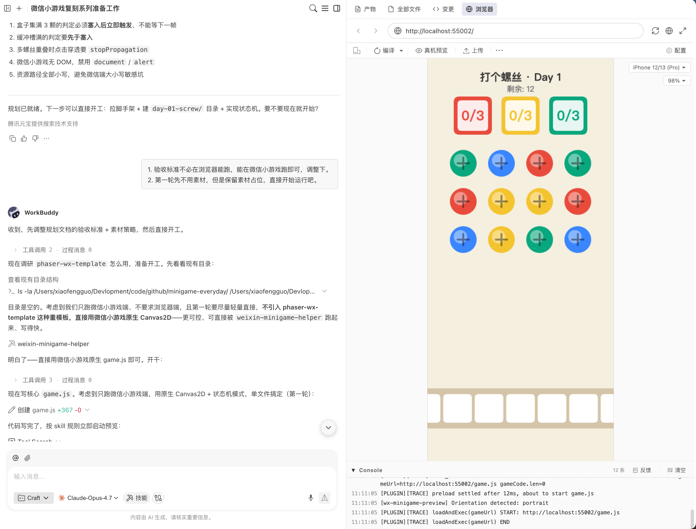
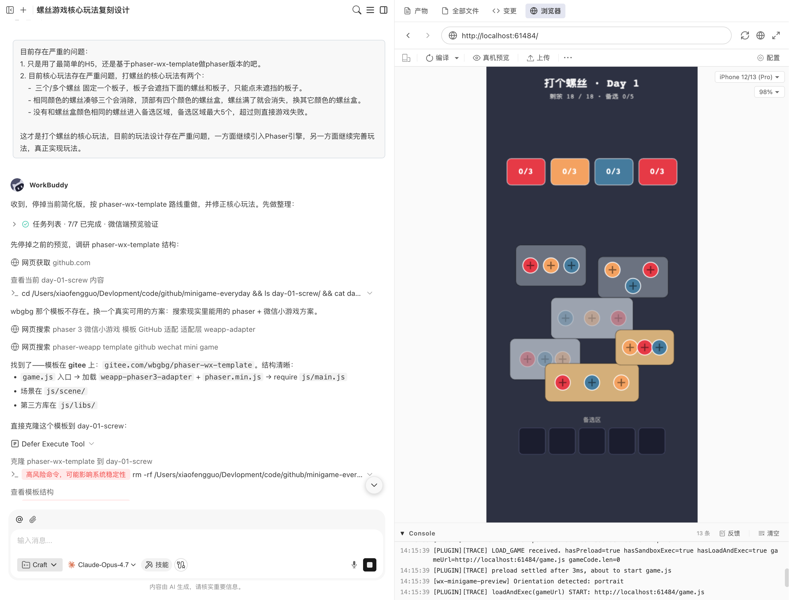
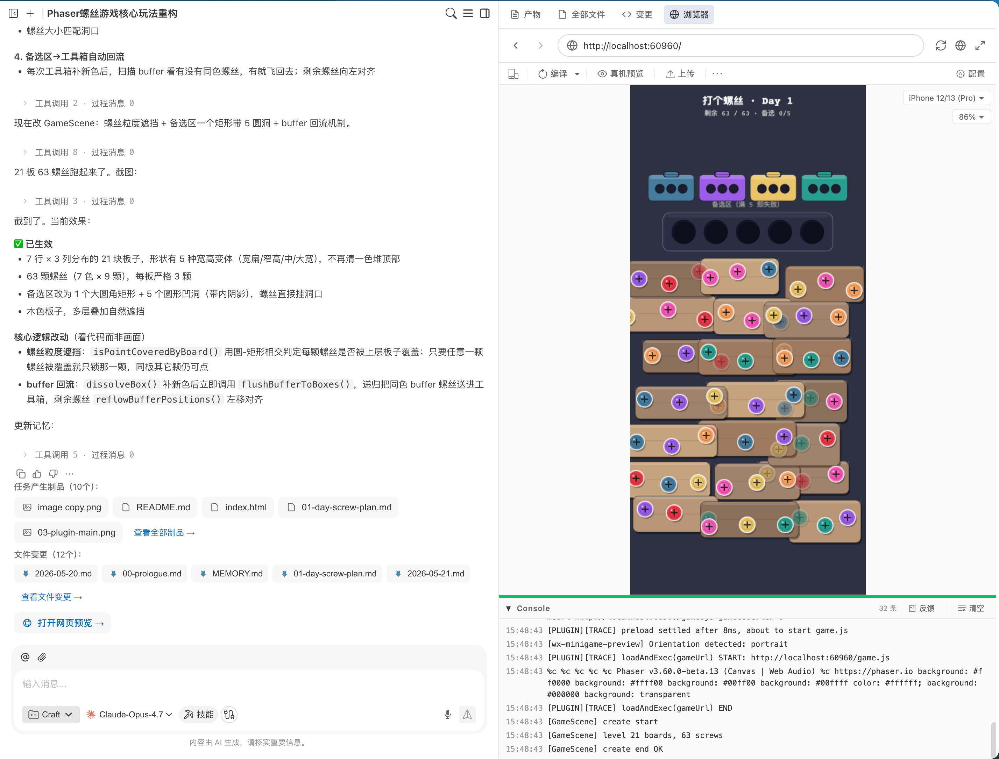

# 用AI每天复刻一个微信小游戏 · Day 1：打个螺丝

> 作者：xiaofengguo · 2026-05-21 · 系列 Day 1

---

## 〇 写在前面

Day 1 选的是《打个螺丝》。

这款游戏在微信畅玩榜上排名第四，但我选它不主要是因为热度——而是因为它是这份清单里逻辑最干净的一个：**没有复杂的物理引擎、没有数值系统、没有需要设计师的美术资产，核心就是一个"拆、放、消"的循环**。适合给整个系列开一个好头，也适合第一次在微信小游戏环境里跑通 AI 写代码 → 截图看效果这个闭环。

结果比预期复杂一点——但也因此学到了更多东西。

---

## 一 游戏介绍

《打个螺丝》是一款解谜益智小游戏，玩法可以用一句话概括：**把板子上的螺丝拧下来，按颜色送进对应的工具箱**。

但真正玩起来，没那么轻松。

游戏场景是一堆叠在一起的木板，每块板子上固定有 3 颗螺丝。上层木板会压住下层的螺丝，被压住的螺丝无法操作——所以你得先想清楚拆哪一块，才能解锁下面想要的颜色。

顶部有 4 个工具箱，每个箱子装满 3 颗同色螺丝就会消除，然后换一个新颜色继续等待。如果点了一颗螺丝，4 个工具箱里没有匹配的颜色，螺丝就会临时待在中间的"备选区"——备选区只有 5 个位置，放满了再想塞就直接失败。

听起来简单，但"工具箱颜色 > 工具箱数量"这个设定，意味着**你几乎必然会遇到需要先把某些颜色'停'在备选区等待的局面**。如何规划顺序、何时消耗备选区的"库存"，才是这个游戏的策略核心。

---

## 二 过程记录

### 2.1 第一步：先调研，再写代码

我的习惯是不急着动手，先让 AI 帮我搞清楚游戏到底长什么样，以及实现上有哪些路可以走。

**我的输入（原文）：**

```
Day 1《打个螺丝》复刻：帮我调研这款游戏的核心玩法规则，以及我复刻需要的素材渠道。
然后根据调研，产出一个实现规划文档 doc/01-day-screw-plan.md。
验收标准：只要微信端能跑，不要浏览器兼容，第一轮不用素材但保留占位。
```

WorkBuddy 先搜了一圈这款游戏的玩法说明，整理出核心规则和实现规划，然后产出了 `doc/01-day-screw-plan.md`。规划文档里包括：玩法三件套的定义、关卡生成逻辑、素材渠道推荐，以及打算用什么技术栈。

**但是，玩法规则一开始理解错了**——这是第一个大坑，后面细讲。

---

### 2.2 第二步：脚手架选型的插曲

规划文档里用的是原生 Canvas，素材先完全代码生成，我当时没有仔细看，直接让它继续了，它动手写了一版。跑起来之后我看了一眼代码量——写了很多胶水代码，UI 层几乎全靠手算坐标。

这不对，游戏引擎就是拿来解决这类问题的。**我打断了它，要求改用 Phaser 3**。



改用 Phaser 之后，又卡在了脚手架上。模板仓库 `wbgbg/phaser-wx-template` 只在 Gitee，GitHub 上找不到——AI 搜了一圈，最后去 Gitee 上才找到。

**我的输入（原文）：**

```
要用 Phaser，模板仓库在 Gitee，不在 GitHub，叫 wbgbg/phaser-wx-template，用这个作为脚手架。
另外，玩法理解错了，正确的是：
- 场景由叠放的板子组成，每板固定 3 颗螺丝
- 顶部 4 个彩色工具箱，同色装满 3 颗消除
- 中间有 5 格备选区（不是底部），放不进工具箱的螺丝临时在这里等
- 备选区满了塞第 6 颗才失败
```

这是第一个比较重要的纠正：**备选区的位置（在中间，不在底部）和它的功能（暂存而不是纯惩罚）**，是后来一系列 UI 和交互决策的基础。

---

### 2.3 第三步：跑通第一版，然后遇到截图超时

代码写完了，用 `weixin-minigame-helper` 在本地起了预览。日志正常，场景加载。

> **值得一提的是**：`weixin-minigame-helper` 运行完之后，WorkBuddy 会立即调用 `get_logs` 读取控制台输出——发现报错之后直接就地修复，不需要人工介入。这个"跑 → 读日志 → 修错"的闭环是自动完成的，省去了大量来回确认的时间。

但截图仍然一直超时，这是性能优化还不够好。



这是微信小游戏的 wx-compat 沙箱的锅——`Phaser.WEBGL` 模式下，截图需要从 GPU 把像素读回 CPU（readback），这个操作在沙箱里会卡死。

**解法：改成 `Phaser.CANVAS`**。CANVAS 模式直接在 2D 上下文操作，截图秒出。

同时还发现另一个问题：`window.devicePixelRatio` 在沙箱里是 `undefined`，直接 `.toFixed()` 会报错崩溃。viewport 要换成 `wx.getSystemInfoSync()` 来取。`scale.zoom` 也要去掉——沙箱里没有 DOM container，zoom 完全不生效，画面会缩小成一个角。

---

### 2.4 第一轮完善：颜色、动画、随机性

第一版跑通之后，问题一眼可见。颜色种类和工具箱数量一样，意味着每颗螺丝都能找到对应的箱子，游戏没有任何压力，肯定能赢。工具箱是用数字计数显示的，没有动画。每次打开游戏布局完全一样。

**我的输入（原文）：**

```
基本玩法没问题了，现在存在的问题：
1. 目前颜色太少了，一共只有四种颜色，四个盒子，肯定是会成功的，不可能失败，
   颜色应该更多，并且大于盒子。
2. 缺少动画和细节。盒子可以有带三个孔的工具箱表示，点击螺丝，螺丝可以飞到
   工具箱的孔里面，不是用数字的方式表示。板子增加重力效果，缺少螺丝固定的
   时候需要因为重力因素滑落，并且会被外层的板子或者螺丝挡住。
3. 缺少随机性，每次打开都是一样的，应该在保证一定能玩的基础上每次随机安排
   板子和螺丝。增加可玩性。螺丝数量也可以多一些。
```

这轮改动完成后，颜色扩到了 6 种（超过 4 个工具箱），工具箱改为可视化的 3 孔结构，螺丝点击后会飞入孔洞，入场加了重力滑落动画，关卡改为随机生成。

**但随之而来了新问题**：螺丝数量一下子增到了 36 颗，36 个对象各自跑独立 tween 入场，截图工具直接超时 10 秒，画面根本出不来。

这是渲染性能的锅，得专门修一轮。

---

### 2.5 第二轮完善：性能优化 + 备选区位置 + 严格 3 颗/板

**我的输入（原文）：**

```
现在存在的问题：
1. 每个板子上可能有多个螺丝，有几个基本规则：每个板子一定是三个螺丝固定，
   可以很多板子，有很多层，但是不能一个板子很多螺丝。每个板子的螺丝需要有
   一定距离，不能太近。
2. 优化渲染性能，目前太卡了，看下 Phaser 如何处理批量渲染和动画。
3. 备选区域还是下面五个方格，实际上应该是在顶部箱子和主要游戏区域之间，
   有五个空洞，如果螺丝颜色和上面五个箱子都不一样，就暂时在备选区域。
   一旦与上面箱子颜色匹配就进入箱子。游戏主要区域可以向下移动一些。
```

这轮改动涉及三件事：

**规则修正**：每块板子严格固定 3 颗螺丝，板内螺丝中心间距必须大于直径 + 8px。之前一块板子可能有 4 颗，而且挨得很近，视觉上很乱。

**性能彻底重写**：
- 所有板子合并到 1 个 Graphics 一次性绘制，工具箱一个，备选区一个——而不是每个对象各自维护独立的 Graphics
- 螺丝改用 `generateTexture()` 预生成纹理（每色"可点"和"不可点"各一张），运行时只 `setTexture()` 切换，不重绘
- 入场动画从"36 个独立 tween"改为把所有元素放进 Container，1 个 tween 控制整体，截图响应从超时直接变成 1-2 秒出图

**备选区位置修正**：备选区从屏幕底部移到了顶部工具箱和游戏区中间，5 个洞位，游戏区整体下移腾出空间。

截图终于能出来了，能看到效果了——然后又发现了新问题。

---

### 2.6 第三轮完善：遮挡粒度、备选回流、布局分布

截图出来之后，能看清楚的问题一下子多了起来。板子全堆在上半屏，下面一大片空白。遮挡逻辑玩起来很憋屈。备选区进去了就出不来。


**我的输入（原文）：**

```
目前存在的问题：
1. 板子的形状过于单一，而且全部堆叠在一起，下面全是空的，板子形状可以随机
   一些。位置可以分布均匀一些，螺丝数量也可以多一些。
2. 遮挡关系不对，如果一个板子挡在另外一个板子上面一部分，挡住了一个螺丝，
   那么这个螺丝应该是不能点的。现在能不能点似乎全部按照板子的维度计算的，
   实际应该按照螺丝的粒度计算，如果螺丝上面没有其它板子，那么就可以点
   （只要有一点被遮挡就不能点）。
3. 备选区域的不要大方块表示，整体有一个矩形框，然后上面有五个洞洞，螺丝在
   洞洞里就可以。
4. 备选区域的螺丝在上面出现新盒子的时候应该检查下，如果上面盒子与备选区域
   螺丝颜色相同，螺丝应该直接到箱子里，剩余螺丝向左移动，不能进了备选区域
   就回不去了。
```

这轮是改动最多的一轮，四个点都是核心问题：

**布局铺满**：板子从堆顶部改为 7 行 × 3 列基础网格铺满游戏区，5 种宽高随机组合，加上随机抖动。螺丝从 36 颗扩到 63 颗（7 色 × 9 颗，21 块板子）。

**遮挡改为螺丝粒度**：之前是"只要上层板子的矩形范围盖住了下层板子的矩形范围，整块板子全锁"。这导致一颗螺丝被挡住，同板的其他两颗也跟着不能点，非常憋屈。

改成：每颗螺丝单独用**圆-矩形相交**来判断，找矩形上离螺丝圆心最近的点，距离小于螺丝半径才算被遮挡——只锁这一颗，同板其他颗不受影响。

**备选区视觉**：5 个独立方块改为一个大圆角矩形框 + 5 个圆形凹洞，螺丝落进洞里，视觉上清楚多了。

**备选区自动回流**：这是最关键的玩法修复。工具箱刷出新颜色之后，立即扫描备选区，找到同色螺丝让它飞回工具箱，剩余螺丝左移对齐，然后递归继续扫。一次消除可能带出一连串的回流——这个链式触发是"备选区不会变成死局"的关键。


---

## 三 复刻成果

三轮迭代下来，这版复刻实现了原版游戏的核心玩法闭环：

**关卡生成**：每局随机生成，7 种颜色 × 9 颗 = 63 颗螺丝，21 块板子。板子形状从 5 种宽高里随机抽，7 行 × 3 列网格铺满游戏区，加上抖动避免整齐划一。每局都不一样，支持 seed 固定关卡做调试。

**核心玩法三件套**：
- 顶部 4 个彩色工具箱，每箱装满 3 颗同色螺丝消除，刷新新色继续等待
- 中间 5 格备选区（圆角矩形 + 5 个凹洞），无同色工具箱时暂存，满 5 格后塞入即触发失败
- 板子叠加遮挡，被上层板子压住的螺丝（按螺丝粒度判定）不可点击，暗色显示

**动画与交互**：点击螺丝后飞入工具箱对应孔洞，工具箱装满白光闪烁后消除，备选区螺丝在匹配工具箱出现时自动飞回并左移对齐，入场整体淡入滑落。通关和失败都有结果界面，点击屏幕随机新关卡重开。

**性能**：CANVAS 模式，同类图形合批绘制，纹理预生成复用，单个 tween 控制整体入场

没做的部分：音效、美术素材（当前全部用代码绘制的程序图形）、难度分级、道具系统。这些作为Demo项目就暂时不展开探索了，后面有机会再深入探索。

---

## 四 今天沉淀的主要内容

除了游戏本身，今天还做了三件比游戏代码更有长期价值的事。

### 4.1 Phaser 微信小游戏模板

把今天踩的所有坑都改进了脚手架模板里，沉淀成一个开箱即用的 Skill：`phaser-weixin-minigame`。

模板包含了改好的完整文件结构：

```
game.js          ← 入口（去掉 worker 相关）
game.json        ← 配置（去掉 workers/subPackages）
js/main.js       ← Phaser 启动（CANVAS / wx.getSystemInfoSync / 无 zoom）
js/libs/         ← Phaser 3 + wx 适配层
js/scene/GameScene.js  ← 示例场景
project.config.json    ← 开发者工具配置（改 appid 即可）
```

下次新建一个游戏，直接复制这个模板就行，不需要再踩一遍同样的坑。

### 4.2 微信小游戏开发经验 Skill

把今天的工作流和踩坑提炼成了通用的 `weixin-minigame-dev` Skill，主要内容：

- **开发工作流**：run_game → preview_url → 等待 → get_logs → capture_screenshot 标准流程，断连的处理方式
- **渲染性能模式**：合批 Graphics / 预生成纹理 / Tween 合批，三件事对 CANVAS 模式性能的影响量级
- **玩法设计模式**：元素粒度遮挡判定 / 缓冲槽自动回流 / 可重播随机关卡生成——这三个模式在益智小游戏里会反复出现

这些不是《打个螺丝》专属的经验，是通用的游戏开发知识，下次做其他类型的游戏也能用到。

### 4.3 系列复盘文章

除了这篇，还在 `doc/01-day-screw.md` 里写了一篇偏技术向的复盘，专门讲代码实现细节。如果你对圆-矩相交判定的写法、buffer 回流的链式触发怎么实现感兴趣，可以去看那篇。

---

## 五 一点思考

今天最意外的收获不是游戏跑起来了，而是发现AI其实很擅长做玩法实现，但是前提是需要我们提供准确的描述和输入。

AI 能搜到这款游戏的介绍文字，但文字里不会写"遮挡判定是按螺丝粒度的"——这需要我们实际玩几局，感受到"整板锁死太憋屈了"，才会意识到真实游戏的实现一定不是这样的。给出具体的反馈之后，AI可以很快实现按螺丝粒度来实现。这当然也是AI缺少的“感觉”，它很难从玩家游玩的角度来去思考问题。

后面我也会持续通过不同游戏的玩法来思考是否可以通过Skill让AI能够去拥有这种“感觉”，而不是仅仅完成我们交代的任务，不说就不会去做，但是目前还没有一个完整的的想法，后续多复刻几个游戏感受下再说。

---

## 六 下一步

Day 2 是《消个水果》。同样属于"收纳消除"类型，但核心机制从"分层遮挡 + 工具箱配色"变成了"悬浮元素 + 底槽 + 相邻同类三消"。

预计今天遇到的工程基础设施（Phaser 模板、预览流程）已经打好了，Day 2 可以更快进入玩法设计本身。

---

*系列仓库：[github.com/IcedSoul/minigame-everyday](https://github.com/IcedSoul/minigame-everyday)*
