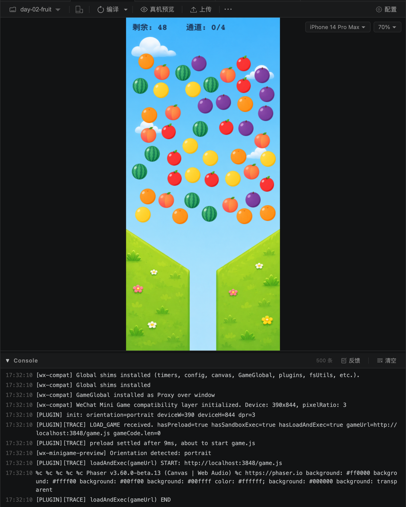
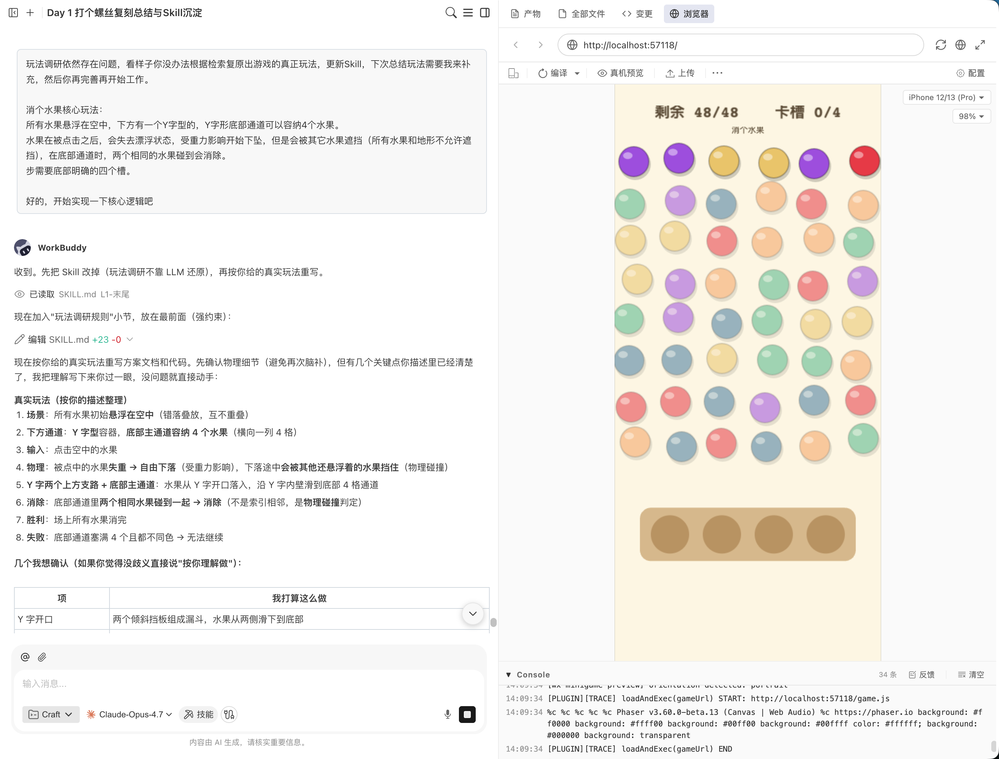
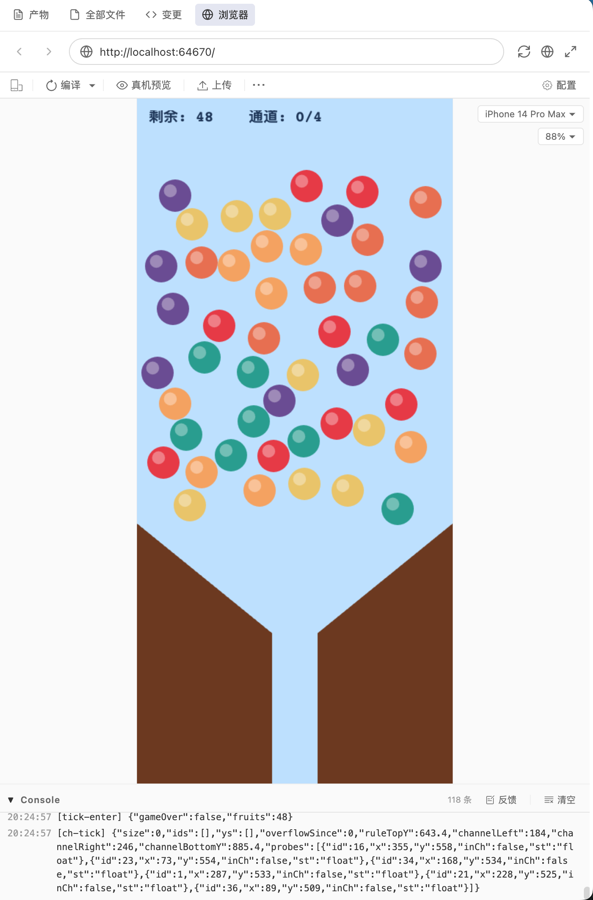

# 用AI每天复刻一个微信小游戏 · Day 2：消个水果

> 作者：xiaofengguo · 2026-05-26 · 系列 Day 2

---

## 〇 写在前面

在这个游戏的实现过程中遇到了一些问题，所以这篇文章拖了几天才发出来。

Day 2 选的是《消个水果》，一款看起来简单但实际上物理细节极多的消除游戏。我最初在 WorkBuddy（腾讯内部的 AI 编码平台）上完成了第一个版本——基本玩法跑通了，水果能悬浮、能点击下落、能在通道里消除。但接下来在调整物理碰撞细节的过程中，改崩了，而且 WorkBuddy 当时不支持代码回滚，导致我无法恢复到之前正确的版本。

于是我切换到了 VSCode + CodeBuddy 插件，配合微信小游戏助手扩展继续开发。后面的物理修复、AI 生图素材接入、scene restart 清理等工作都是在这个环境下完成的。

---

## 一 游戏介绍

《消个水果》是一款物理消除小游戏，核心玩法可以用一句话概括：**屏幕上方悬浮着一堆水果，点击任意一颗让它获得重力下落，同色水果在底部通道碰撞接触后消除，通道堆满则失败。**

具体来说：

- 屏幕上半部分散布着 48 颗水果（6 种颜色 × 4 对 × 2 颗），全部无重力悬浮
- 下半部分是一个 Y 字形漏斗，连着一段只能容纳单列水果的窄通道
- 点击任意水果，**只有那一颗**获得重力开始下落，其他水果仍然悬浮
- 下落过程中会被其他悬浮水果和漏斗墙体物理阻挡
- 水果最终汇入底部通道垂直堆叠
- **两颗同色水果在通道中物理接触后自动消除**
- 通道堆满 4 颗且无法消除时游戏失败；所有水果清空则胜利

这个游戏的核心创新点是"点击触发单体重力"——不是所有水果一起掉，而是你选择哪颗先掉。这意味着顺序策略非常重要：先放哪颗、后放哪颗，直接决定通道里能不能配对消除。



---

## 二 过程记录

### 2.1 第一步：玩法调研与方案确认

Day 1 的教训告诉我，**不能靠 AI 的模糊印象来还原一款游戏的玩法**。所以这次我先玩了几局原版，然后口述核心规则给 AI，让它产出方案文档。

**我的关键输入：**

> 屏幕上方一片悬浮水果（无重力错落叠放），下方是一道 Y 字漏斗连着一段竖直窄通道。点击空中任意水果即给它单独施加重力，水果开始下落。通道底部最下两颗同色水果自动消除。通道一旦堆满 4 颗且再无可消除时判负；屏幕全部清空判胜。

AI 据此产出了 `doc/02-day-fruit-plan.md`，包含完整的技术方案：选用 Phaser 3 + Matter.js 物理引擎（Day 1 用的是 Arcade Physics，不支持斜面和稳定堆叠），48 颗水果的布局策略，Y 字漏斗的几何参数，以及状态机设计。

**关键技术决策**：从 Arcade Physics 切换到 Matter.js。原因很明确——Arcade 只支持 AABB 矩形碰撞，Y 字斜墙必须"楼梯化"成 24 段；圆与圆堆叠会抖动卡死。Matter.js 原生支持任意角度刚体、圆形稳定堆叠、sleeping 机制，完美匹配这个游戏的需求。

---

### 2.2 第二步：WorkBuddy 上的第一版（已崩）

第一版在 WorkBuddy 上完成，基本玩法跑通了：

- 48 颗纯色圆形水果悬浮在上半屏
- 点击后单颗获得重力下落
- Y 字漏斗引导水果进入通道
- 通道内同色相邻消除
- 胜负判定正常

但在调整"通道判定高度"和"失败条件"的过程中，反复修改导致物理逻辑崩溃——水果不再正确判定失败，`setInterval` 的 tick 函数不再被调用（因为从 `setInterval` 切换到了 Phaser 的 `time.addEvent`，而后者在微信小游戏沙箱中不工作）。

**无法回滚，只能切换环境重新来过。**



---

### 2.3 第三步：切换到 VSCode，核心开发

切到 VSCode + CodeBuddy（AI 编码插件）+ 微信小游戏助手扩展后，相当于从零重新开始。

这里要介绍一下**微信小游戏助手**（WeChat Mini Game Helper）——这是一个 VSCode 扩展插件，专门为微信小游戏开发设计。它的核心能力是：在 VSCode 内直接启动一个本地预览服务器，模拟微信小游戏的运行环境（包括 `wx` API 兼容层、Canvas 渲染、触摸事件等），开发者无需打开微信开发者工具就能实时预览游戏效果。同时它还支持真机预览（扫码在手机上运行）、一键上传发布、Console 日志查看等功能。对于 AI 编码场景，它还暴露了 MCP 工具接口，让 AI 可以直接调用 `run_game`、`reload_game`、`capture_screenshot`、`get_logs` 等能力，实现"改代码 → 自动重载 → 截图看效果 → 读日志排错"的全自动开发循环。实际上，这和 WorkBuddy 中内置的 weixin-minigame-helper 是同一套工具链，只是运行在不同的编辑器环境中。

有了这个插件，从 WorkBuddy 切过来几乎没有环境成本——同样是写代码、跑游戏、看效果，只是换了个编辑器。AI 从 Day 1 的脚手架拷贝目录结构，然后切换到 Matter.js 物理引擎，逐步实现完整玩法。

#### 搭建脚手架 + 切 Matter.js

**我的输入：**

> 开始实现吧

AI 从 `day-01-screw/` 拷贝了基础文件（game.js、index.html、phaser.min.js、wx-compat 适配层等），然后重写了三个核心文件：
- `main.js`：从 Arcade 物理切换到 Matter（`physics: { default: 'matter', matter: { gravity: { y: 1 } } }`）
- `config.js`：定义水果半径、通道宽度、漏斗比例等常量
- `GameScene.js`：实现泊松采样布局、Y 字漏斗静态墙体、点击下落、通道判定、二消逻辑

#### 修复 Matter Plugin silent bug

第一次 `run_game` 直接白屏崩溃，报错：`Cannot read properties of undefined (reading 'silent')`。

**排查过程**：AI 逐步缩小范围——注释掉 `create()` 全部逻辑只画背景 → 仍然崩 → 去掉 physics 配置 → 不崩了 → 确认是 Matter 物理引擎初始化时崩溃。

**根本原因**：Phaser 3.60.0-beta.13 内置的 Matter.js Plugin 系统有 bug——`Plugin.use()` 在 `sortedDependencies` 为空数组时，循环结束后 `plugin` 变量是 `undefined`，但仍然访问 `plugin.silent`。

**解决方案**：写了一个 `matter-plugin-fix.js` monkey-patch，在 Phaser 加载后、游戏启动前注入：

```js
const M = Phaser.Physics.Matter.Matter;
const origUse = M.Plugin.use;
M.Plugin.use = function(module, plugins) {
  if (!plugins || plugins.length === 0) return;
  return origUse.call(this, module, plugins);
};
```

#### 修复 ignoreGravity 不生效

悬浮水果全部直接下落——`body.ignoreGravity = true` 完全没用。这是 Phaser 3.60 的已知 bug（GitHub issue #6473）：`Engine._bodiesApplyGravity` 没检查 `ignoreGravity` 属性。

**解决方案**：同样在 `matter-plugin-fix.js` 中 patch `_bodiesApplyGravity`，跳过 `ignoreGravity === true` 的 body。后来在物理体与图片解耦阶段，改用 `Matter.Body.setStatic(true)` 替代 `ignoreGravity`，彻底绕开了这个 bug。

#### 物理参数调优（多轮迭代）

基础功能跑通后，进入了漫长的物理参数调优：

**问题 1：水果卡在漏斗斜壁上不滑下来**
- 原因：斜壁 `friction=0.4` 太高，圆球在高摩擦斜面上很容易停住
- 修复：所有斜壁 `friction: 0, frictionStatic: 0`

**问题 2：水果之间碰撞后持续抖动**
- 原因：Matter 默认 `positionIterations=6` 不够，加上 `restitution > 0` 导致微小弹跳
- 修复：`positionIterations: 10, velocityIterations: 8`，水果 `restitution: 0`

**问题 3：通道太窄水果进不去**
- 原因：通道宽度 = 水果直径 + 8px，加上墙壁厚度占位，实际可通过宽度不够
- 修复：`CHANNEL_WIDTH = FRUIT_RADIUS * 2 + 18`（62px）

**问题 4：视觉大小和物理大小不一致**
- 纹理生成时加了 padding/描边，`setDisplaySize` 缩放后视觉圆比物理体小一圈
- 经过多轮日志诊断（打印 bodyR、displayW、scaleX、frameW、bounds 等），最终确认：纹理必须精确等于 `FRUIT_RADIUS * 2`，不加任何 padding，不做任何缩放

**问题 5：未释放的水果被撞动**
- 原因：`ignoreGravity=true` 的水果仍然是动态体，会接收碰撞冲量
- 修复：悬浮水果初始 `Matter.Body.setStatic(true)`，点击释放时才 `setStatic(false)`

**问题 6：tick 规则不触发**
- 原因：`this.time.addEvent` 依赖 Phaser 内部时间系统，而微信沙箱的 `performance.now()` 返回秒而非毫秒，导致 TimerEvent 永远不 fire
- 修复：退回原生 `setInterval`，在 `shutdown` 事件中 `clearInterval`

这些问题前后花了十几轮对话才全部解决。每个问题看起来都很小，但在物理引擎里它们互相耦合——改了摩擦力影响堆叠稳定性，改了通道宽度影响消除判定，改了 static/dynamic 影响碰撞响应。



---

### 2.4 第四步：接入 AI 生成的图片素材

纯色圆球版本跑通后，我决定接入真实的水果图片和背景，让游戏看起来像个真正的产品。

#### 第一步：基于游戏数据生成精确提示词

**我的输入：**

> 现在我们来让 AI 生图来生成对应的水果和背景图片，你给我提示词，说清楚需要的水果种类、图片风格、每个水果的大小（精确到像素）、背景图片的大小、Y 型区域的位置也精确到像素，确保拿到素材你可以直接使用。

AI 先读取了游戏的 `config.js`，确认了所有几何参数（画布 390×844、`FRUIT_RADIUS=22`、`CHANNEL_WIDTH=62`、漏斗顶 y=523、漏斗底 y=658 等），然后据此生成了一份**精确到像素的提示词包**：

- **水果统一风格基底**：Flat vector illustration, slightly cartoonish but clean and modern, perfectly circular silhouette, 88×88 px, transparent background
- **6 种水果各自的描述**：苹果（红色 #e63946 + 绿叶）、橘子（#f4a261 + 段纹）、柠檬（#e9c46a + 气孔纹理）、西瓜（#2a9d8f + 深绿条纹）、葡萄（#6a4c93 + 光泽）、桃子（#e76f51 + 绒毛渐变）
- **背景提示词**：包含精确的 Y 字形几何坐标，附带 ASCII 示意图帮助 AI 理解空间关系

#### 第二步：用 ChatGPT Image（gpt-image-2）生成图片

我使用 ChatGPT 的 gpt-image-2 模型生成了两张图：
- 一张 **2×3 网格的水果合图**（1536×1024），6 种水果排列在白色背景上
- 一张 **完整背景图**（853×1844），蓝天 + 绿色草地 + Y 字形通道

第一次生成的背景风格偏写实，我反馈了风格优化建议（更扁平、更卡通），第二次生成的效果就很好了。水果合图一次就通过了——因为提示词里对颜色、形状、尺寸的描述足够精确。

#### 第三步：AI 写 Python 脚本处理图片

拿到原始图片后，我把文件路径告诉 AI，让它写脚本来完成切割和处理。AI 生成了 `tools/slice_assets.py`（Python + Pillow）：

- **水果切割**：把 1536×1024 的网格图按 2×3 切成 6 块（每块 512×512），然后对每块做：
  - 白底抠透明：软阈值 alpha matting（`min(r,g,b) ≥ 240` 全透明，`≤ 215` 全不透明，中间线性渐变），避免锯齿和白边光晕
  - 自动 trim 到 alpha bounding box
  - 居中缩放到 88×88（@2x），代码里 `setDisplaySize(44, 44)` 显示
- **背景处理**：直接把原图 resize 到 390×844

#### 第四步：接入游戏代码

脚本跑完后产出 7 个文件（6 个水果 PNG + 1 个背景 PNG），AI 修改了 `GameScene.js`：
- `preload()` 中 `this.load.image` 加载所有素材
- `drawBackdrop()` 用 `this.add.image('bg_stage').setDisplaySize(w, h)` 替代手绘
- 水果创建后 `setDisplaySize(FRUIT_RADIUS*2, FRUIT_RADIUS*2)` 强制到物理体直径

**关键教训**：第一版脚本试图用多边形 mask 把草地切成精确的梯形 wedge，结果把原图 V 形开口的天空蓝色带进了通道区域，看起来像一道蓝色的水流。我反馈后改为"直接 resize，不做任何合成"——**最简单的方案往往最可靠**。

---

### 2.5 第五步：物理体与图片解耦（核心大坑）

接入图片后，**物理碰撞完全崩了**——水果之间可以重叠，水果穿进草地里。

**根本原因**：`matter.add.image()` 创建的 body 尺寸可能与纹理尺寸绑定，而不是你指定的 `shape.radius`。水果 PNG 是 88×88（2x 高清），`setDisplaySize(44, 44)` 缩放显示，但 body 的实际碰撞半径和纹理原始尺寸之间的关系是模糊的。

**我的输入：**

> 不是，完全没修复呀，现在水果的物理体积和视觉体积完全不同，水果对象的物理大小真的和真实大小一样么，现在碰撞都是交叉很多才认为是碰撞。重新审视物理计算逻辑。

**最终解决方案**：完全解耦渲染和物理——

```js
// 1) 纯渲染 Image（不是 Matter Image）
const img = this.add.image(x, y, textureKey);
img.setDisplaySize(FRUIT_DISPLAY_SIZE, FRUIT_DISPLAY_SIZE); // 44px

// 2) 独立 Matter circle body
const body = this.matter.add.circle(x, y, FRUIT_RADIUS, bodyOptions); // 20px

// 3) 手动关联
img.body = body;
body.gameObject = img;

// 4) 每帧 update() 中同步位置
```

`FRUIT_RADIUS = 20`（物理）比 `FRUIT_DISPLAY_SIZE/2 = 22`（视觉）小 2px，这样水果之间看起来紧密贴合而不是有缝隙。

---

### 2.6 第六步：通道墙体几何对齐（反复 5 轮）

物理体解耦后，下一个问题是：**水果进不了通道**，或者**水果穿出通道进入草地**。

这个问题来回修了 5 轮，核心矛盾是：**墙体的"中心线"、"内壁面"、"外壁面"三者的关系**。

- `matter.add.rectangle(cx, cy, width, height)` 中 `(cx, cy)` 是矩形的**中心**
- 墙厚 `WALL_THICK = 8`，所以内壁面 = 中心 ± 4px
- 如果把中心放在草地视觉边缘上，内壁面会向通道内突出 4px

**我的关键输入：**

> 水果与草地之间距离更远，水果都落不下来，明明上一个版本是正确的，这个版本反而更远了，物理边界应该贴合实际的边界。

最终方案：用 Python 脚本精确测量 resize 后背景图的草地几何（像素扫描找到内沿坐标），把测量值写入 config：

```
FUNNEL_TOP_RATIO = 0.635    // 草地顶部 y ≈ 536
FUNNEL_BOTTOM_RATIO = 0.758 // 草地汇聚 y ≈ 640  
CHANNEL_WIDTH = 67          // 通道内宽（实测）
```

墙的中心线就放在草地视觉边缘上，墙厚从 12 减到 8，让内壁突出量从 6px 降到 4px。通道有效内宽 = 67 - 8 = 59px，水果物理直径 40px，间隙 19px，完全够通过。

---

### 2.7 第七步：消除判定改为真实碰撞

之前的消除逻辑是"按 y 排序后索引相邻 + 同色就消除"——这导致两个同色水果一个在通道顶、一个在通道底，只要中间没有其他同色水果，它们就会被判定为"相邻"而瞬间消除。**水果还没碰到就消失了。**

**我的输入：**

> 水果还没碰到，只是到通道就开始消失，这不合理，只有水果撞到了才消失。

**解决方案**：用 Matter 的 `collisionstart` / `collisionend` 事件追踪真实接触对——

```js
this.matter.world.on('collisionstart', (event) => {
  for (const { bodyA, bodyB } of event.pairs) {
    if (bodyA.label !== 'fruit' || bodyB.label !== 'fruit') continue;
    this.touchingPairs.add(pairKey(idA, idB));
  }
});
```

消除条件变为：**物理接触 + 同色 + 双方在通道内 + 双方几乎静止**。四个条件缺一不可。

---

### 2.8 第八步：Dissolving 阶段不能用 sensor

消除动画播放期间，最初把 body 设为 `isSensor = true`，想法是"让后续水果穿过正在消失的水果"。但这导致了严重问题：后续落下的水果直接穿透了正在消失的水果，和下面的水果重叠。

**解决方案**：消除动画期间把 body 设为 `static`（而非 sensor），保持物理阻挡直到动画结束才真正移除。

---

### 2.9 第九步：斜面抖动与 Scene Restart

**斜面抖动**：水果碰到漏斗斜面时会抖动。原因是斜面的 `friction > 0`。Matter.js 的摩擦力 = `sqrt(frictionA × frictionB)`，把斜面的 friction 设为 0，任何物体在斜面上都无摩擦，问题解决。

**Scene Restart**：这是最折腾的问题，来回修了 5 轮。`scene.restart()` 会销毁 Phaser GameObjects，但**独立创建的 Matter bodies 不会被自动清理**。尝试过的方案：

1. `scene.restart()` → 旧 body 残留 ❌
2. `scene.stop()` + `scene.start()` → 同样问题 ❌
3. `scene.remove()` + `scene.add()` → 在 pointerdown 回调中销毁自身导致崩溃 ❌
4. `setInterval` 的 tick 没被清除 → 旧 tick 在已销毁场景上继续运行 → 无限循环判定失败 ❌

**最终方案**：在 pointerdown 中手动清理一切，然后延迟一帧 restart——

```js
if (this.gameOver) {
  clearInterval(this.tickIntervalId);
  // 手动移除所有 Matter bodies
  for (const f of this.fruits) {
    this.matter.world.remove(f.body);
    f.body = null;
    if (f.active) f.destroy();
  }
  // 清空整个 Matter world
  M.Composite.clear(this.matter.world.localWorld, false, true);
  // 延迟一帧再 restart
  this.time.delayedCall(0, () => this.scene.restart());
}
```

---

## 三 复刻成果

最终版本实现了完整的游戏闭环：

**核心玩法**：
- 48 颗真实水果图片（苹果、橘子、柠檬、西瓜、葡萄、桃子）悬浮在蓝天背景上
- 点击单颗水果释放重力，经 Y 字形草地漏斗滑入底部通道
- 同色水果物理碰撞接触后闪烁消除
- 通道满 4 颗判负，全部清空判胜

**物理表现**：
- 水果之间紧密贴合无缝隙（物理半径 20px < 视觉半径 22px）
- 漏斗斜面零摩擦，水果光滑滑下无抖动
- 通道侧壁精确对齐草地视觉边缘
- 防隧穿速度限制（单帧位移 < 半径）

**视觉效果**：
- AI 生成的水果图片（带光泽、叶子、纹理）
- AI 生成的草地 + 蓝天背景，Y 字通道自然形成
- 消除时轻微闪烁后淡出，简洁不花哨

**没做的部分**：音效、道具系统、多关卡、难度分级。

---

## 四 今天沉淀的主要内容

### 4.1 Phaser + Matter.js 物理引擎经验

这次最大的收获是把 Matter.js 在微信小游戏中的各种坑都踩了一遍，并沉淀成了可复用的模式：

- **模式 F**：物理体与图片必须解耦（`add.image` + `matter.add.circle`，每帧手动同步位置）
- **模式 G**：Scene restart 必须手动清理 Matter world（`Composite.clear` + 延迟 restart）
- **模式 H**：墙体几何用脚本测量背景图，反向校准 config
- **模式 I**：消除判定必须基于真实碰撞事件（`collisionstart/end`）
- **模式 J**：Dissolving 阶段用 `setStatic` 而非 `isSensor`
- **模式 K**：`update()` 中限速防隧穿
- **模式 L**：斜面 `friction = 0` 消除抖动

### 4.2 AI 生图素材接入流程与思考

从"给 AI 提示词"到"游戏里用上图片"的完整流程：
1. 从游戏 config 读取精确几何参数，换算成像素值
2. 编写 AI 生图提示词（明确尺寸、风格、透明背景）
3. Python 切图脚本（网格切割 + 白底抠图 + trim + 居中缩放）
4. 像素级几何测量（扫描 resize 后的背景图，找到草地边界坐标）
5. 反向校准 config（让物理墙与视觉边界对齐）

**核心教训**：背景图直接 resize 最可靠，不要自作聪明做 mask 合成。

**关于 AI 生图的思考**：

这次的素材需求比较简单——只有背景图片 + 6 种水果图片。但已经完整验证了 **AI 生图 + AI 代码** 的端到端工作流：

1. AI 根据游戏 config 自动计算精确像素规格
2. AI 生成提示词 → 人类用 gpt-image-2 出图 → 人类反馈风格优化
3. AI 写 Python 脚本完成切割/抠图/缩放
4. AI 修改游戏代码接入素材
5. AI 用像素扫描脚本测量背景几何 → 反向校准物理 config

整个流程中人类只需要做两件事：**在 ChatGPT 里点「生成」按钮**，以及**给出风格反馈**。其余全部由 AI 完成。

后续如果游戏素材更复杂（角色动画、多场景背景、UI 组件），这套流程可以沉淀成一个标准化的工作流模板——甚至可以做成一个 Skill，让 AI 在需要素材时自动走完「规格计算 → 提示词生成 → 切图脚本 → 代码接入 → 几何校准」的全链路。

### 4.3 更新了两个 Skill

把这次的经验更新到了 `weixin-minigame-dev`（通用开发经验）和 `phaser-weixin-minigame`（模板知识）两个 Skill 中，下次做物理类游戏可以直接复用。

---

## 五 一点思考

### 关于物理引擎的"看起来对"vs"真的对"

这次最深的体会是：**物理引擎的 bug 往往不是"完全不工作"，而是"看起来差不多但细节全错"**。

水果能掉下来、能碰到墙、能停住——看起来物理是对的。但仔细看：水果之间有 4px 缝隙（物理半径 > 视觉半径）、水果穿进草地 2px（墙体内壁面偏移）、还没碰到就消失（消除判定用索引而非碰撞）。每个问题单独看都是"差一点点"，但加在一起就是"完全不对"。

这种"差一点点"的 bug 是最难让 AI 自己发现的——因为它需要**玩家视角的感受**。AI 看代码逻辑是对的，看日志数据也是对的，但你一玩就知道"这不对"。这也是为什么我需要反复截图、反复描述"哪里不对"，AI 才能定位到真正的问题。

### 关于回滚的重要性

Day 2 最大的时间浪费来自"改崩了无法回滚"。在 WorkBuddy 上改了十几轮物理参数，每一轮都在上一轮的基础上改，最后完全搞不清楚哪个版本是对的。切到 VSCode + AI 插件后有 git，有单轮会话回滚，每次大改前可以 commit，改崩了直接 revert，也可以单个会话回滚，方便很多。

**教训**：AI 编码工具必须有版本管理能力。不是"能不能写代码"的问题，而是"改错了能不能回去"的问题。在 WorkBuddy 出会话回滚功能之前，我不打算切换回 WorkBuddy 了。

### 关于对话轮次与效率

Day 1 大约 10 轮对话完成。Day 2 超过 30 轮，其中一半以上是在修物理细节。原因是物理引擎的问题往往需要"改 → 跑 → 看效果 → 截图反馈 → 再改"的循环，每个循环至少 2-3 轮对话。

如果未来 AI 能自己"玩"游戏（而不是只看代码和日志），这个循环可以大幅缩短。目前微信小游戏助手工具的 `capture_screenshot` 只能看静态画面，看不到"水果在斜面上抖动"或"两个水果重叠了一半"这种动态问题。

---

## 六 下一步

Day 3 是《一箭又一箭》。经过两天的经验，Phaser 模板和开发工作流已经非常成熟了，物理引擎的各种坑也踩得差不多了。下一个游戏换一个类型——操作类，看看 AI 在不同玩法类型上的表现差异。

---

*系列仓库：[github.com/IcedSoul/minigame-everyday](https://github.com/IcedSoul/minigame-everyday)*
