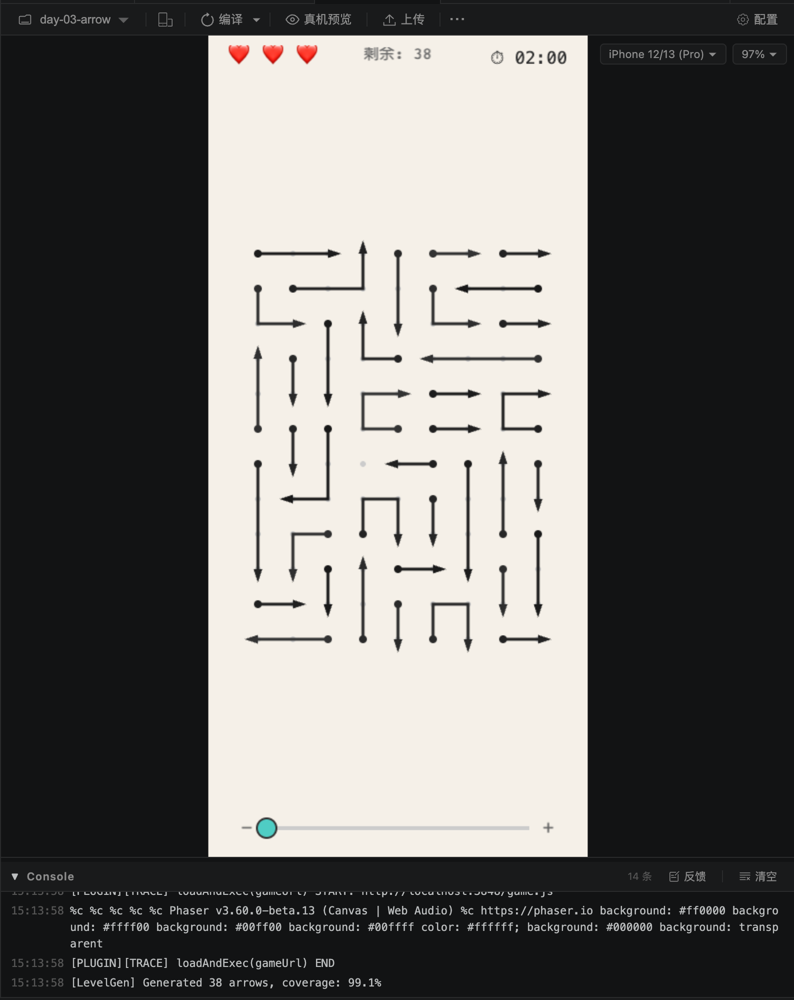
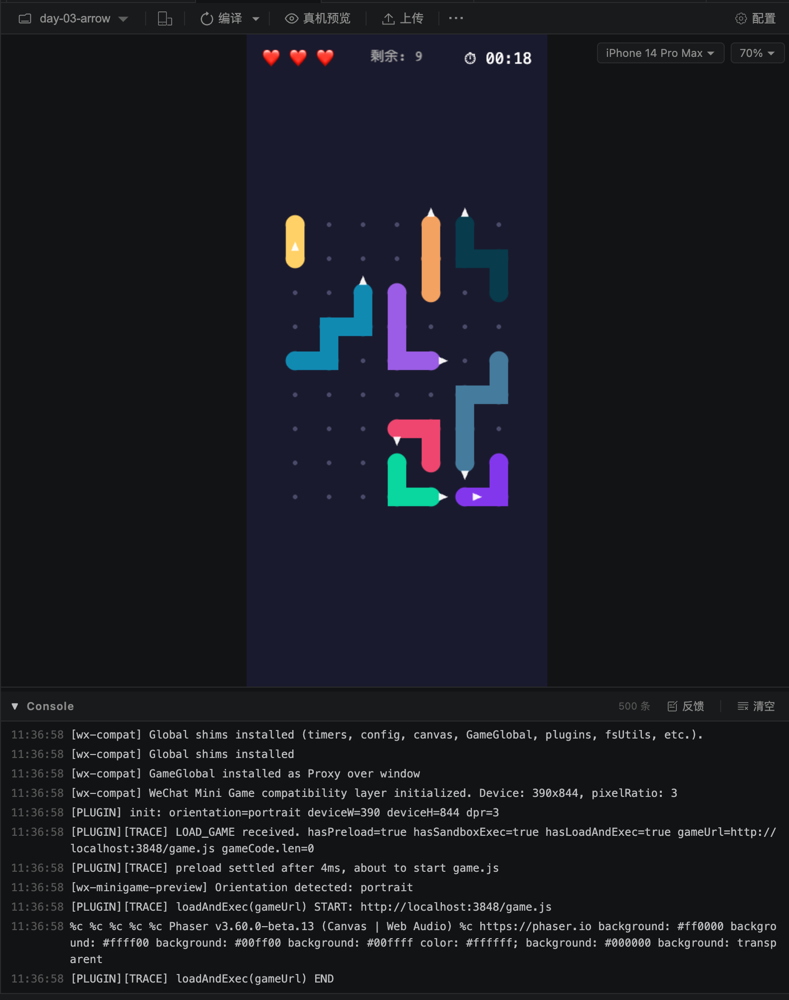
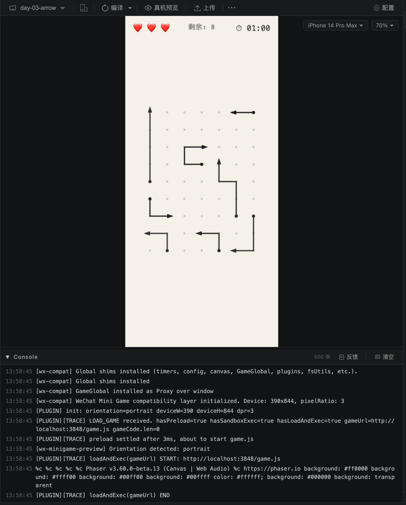

# 用AI每天复刻一个微信小游戏 · Day 3：一箭又一箭

> 作者：xiaofengguo · 2026-05-27 · 系列 Day 3

---

## 〇 写在前面

Day 3 选择复刻的是《一箭又一箭》。

和前两天不同，这款游戏的实现重点不在物理引擎（Day 2 的 Matter.js 碰撞调参花了大量时间），也不在美术素材（全程代码绘制，没有任何外部图片）。它的核心挑战在两个地方：**动画表现**和**动态生成可解的谜题算法**。

动画方面，一条线段像贪吃蛇一样逐格前进、碰撞退回、移出屏幕——听起来简单，但在微信小游戏的 Phaser 沙箱环境中，从"能动"到"流畅不闪烁"经历了三次完整重写。算法方面，要在 9×12 的网格上随机生成 30-40 条箭头，保证 99%+ 的覆盖率，同时保证一定有解（不存在循环死锁），这个约束组合比想象中复杂得多。

---

## 一 游戏介绍

《一箭又一箭》是一款路径解谜小游戏，核心玩法可以用一句话概括：**在点阵网格上，点击箭头线段使其像贪吃蛇一样向箭头方向移动，撞到其他线段则退回，成功移出边界则消除，消除所有箭头即胜利。**

具体规则：

- 游戏区域是 9×12 的矩阵式点阵，几乎所有点都被线段覆盖
- 线段由 2-5 个连续网格点组成，可以是直线也可以拐弯（L 形、S 形）
- 每条线段有一个箭头，方向与线段末端方向一致
- 点击线段后，它像贪吃蛇一样逐格向箭头方向前进
- 如果头部撞到其他线段 → 变红退回原位，记一次失败
- 如果头部移出网格边界 → 整条线段逐格滑出屏幕，消除成功
- 最多 3 次失败或倒计时结束 → 游戏失败
- 所有线段消除 → 游戏胜利



---

## 二 过程记录

### 2.1 第一步：玩法描述与方案确认

这次我直接给出了完整的玩法描述，因为这款游戏的规则足够清晰：

**我的输入（原文）：**

```
现在继续开发第三天的复刻游戏：一箭又一箭，下面是一箭又一箭的核心玩法：
1. 游戏主要区域是 m * n 个矩阵式的点阵。
2. 有多个不等长度的线段箭头，线段的长度可能是 n * x，也可能拐弯，
   但是必然是连接多个点，并且只有一个单向箭头。
3. 点击一个线段，线段会整体向箭头开始向前移动，就像贪吃蛇一样，
   有流畅的动画效果，如果箭头遇到其它线段，则会被挡住，线段变成红色，
   退回原位。如果没有被挡住，则会移动出游戏区域，消除成功。
4. 点击线段撞到其它线段记做一次失败，最多失败三次，游戏结束。
   从第一次点击开始计时，倒计时结束还没有完全消除，游戏失败。
5. 所有线段每次游戏随机生成，但是避免两个或者多个线段互相锁死，
   谁都无法出来，保证一定有解决方案。
```

AI 据此产出了方案文档 `doc/03-day-arrow-plan.md`，包含完整的技术方案：纯 Phaser 3 + Tween 动画（不需要物理引擎），7×9 点阵网格，贪吃蛇式逐格前进算法，以及"逆向构造 + 贪心验证"的关卡生成策略。

**关键技术决策**：这是一个纯逻辑 + 动画的网格游戏，所有碰撞判定基于网格坐标，不需要连续物理模拟。所以不启用任何物理引擎，只用 Phaser 的渲染和动画能力。

---

### 2.2 第二步：第一版实现——粗彩色线段

确认方案后，AI 从 Day 1 沉淀的的脚手架拷贝目录结构，去掉物理引擎配置，实现了第一版。

第一版的视觉效果是：深色背景 + 粗彩色线段 + 白色三角形箭头。功能上基本跑通了——线段能渲染、能点击、有移动的意图。但问题很明显：



**我的反馈（原文）：**

```
存在严重的问题：
1. 不需要这么粗的线段，细一些，全部都是黑色，箭头是正常的箭头，
   就像正常的连接线一样，完全重绘线段和箭头。
2. 点击之后应该是像贪吃蛇一样向箭头方向前进，现在点击之后是闪烁
   或者完全不动，效果完全不对。
```

这一轮修改后，视觉改为细黑线 + 正常三角形箭头 + 浅色背景，看起来干净多了。但动画仍然有严重问题——点击后要么闪烁，要么完全不动。

---

### 2.3 第三步：动画系统的三次重写

这是 Day 3 最折腾的部分。动画系统前后经历了三次完整重写，每次都是因为发现了根本性的架构问题。

#### 第一次尝试：Phaser Tweens（失败）

最初用 Phaser 的 `this.tweens.add()` 来驱动 Graphics 对象的 x/y 移动。结果发现：**在微信小游戏的 `forceSetTimeOut` 模式下，Phaser tweens 对 Graphics 对象不工作**。tween 创建了但 `onUpdate` 回调不触发，动画完全静止。

#### 第二次尝试：async/await + setTimeout（部分工作）

改用 `async/await` + `setTimeout` 的回调链模式。动画能动了，但存在严重的闪烁和跳跃——因为每一步都是"先更新逻辑状态，再重绘"，中间有一帧的视觉跳变。

#### 第三次重写：update(time, delta) 循环（成功）

**我的关键输入：**

```
禁止使用setInterval 驱动动画引擎，这个效果极差，在游戏引擎里面玩法无法接受：
调研Phaser引擎动画实现的最佳逻辑，现在动画表现极差，仍然闪烁，卡顿。
动画使用统一的解决方案，要最佳实践，整体流畅，完善，线是一点点向前移动，
不会闪烁，跳跃。
```

AI 调研后发现了关键事实：**Phaser 的 `update(time, delta)` 方法在 `forceSetTimeOut` 模式下也会被正常调用，每秒 60 次**。这是唯一可靠的动画驱动方式。

最终方案：

```js
// 唯一的动画驱动器
update(time, delta) {
  if (!this.anim) return;
  const a = this.anim;
  a.elapsed += delta;
  const progress = Math.min(a.elapsed / a.duration, 1);
  // 线性插值 Graphics 的 x/y 偏移
  g.x = a.startX + (a.targetX - a.startX) * progress;
  g.y = a.startY + (a.targetY - a.startY) * progress;
  if (progress >= 1) {
    this.anim = null;
    if (a.onComplete) a.onComplete();
  }
}
```

核心思路是：**Graphics 只在 segments 逻辑变化时重绘一次，动画期间只移动 x/y 偏移量**。这样每帧只需要更新两个数字，不需要重绘整个图形，性能极好且完全不闪烁。

验证结果：`update()` 确实每秒被调用 60 次，动画丝滑流畅。

---

### 2.4 第四步：贪吃蛇式移动的正确实现

动画引擎解决后，下一个问题是移动逻辑本身。

**我的反馈：**

```
目前箭头移动似乎不像是贪吃蛇一样活动前进，反而是平移+变形，这是不对的，
应该是线条形式一点点向前移动，头部向前，尾部变短，而不是整体平移。
```

正确的贪吃蛇移动分两个阶段：

**正常移动阶段**（头部在网格内）：
1. 先做动画：整体向前滑动一格（`graphics.x/y` 从 0 到一格距离）
2. 动画完成后：更新逻辑（头部前进一格，尾部移除一格），重绘，重置偏移为 0
3. 重复

**退出阶段**（头部已到边界）：
1. 先做动画：整体继续向前滑动一格（累积偏移，不重置）
2. 动画完成后：移除尾部，重绘（保持累积偏移）
3. 重复直到所有 segments 都被移除

**关键洞察**：退出阶段必须使用**累积偏移量**，不能每步重置为 0。因为退出时 segments 的逻辑位置不变（只是少了尾部），如果重置偏移，图形会"跳回"到旧位置。

---

### 2.5 第五步：碰撞退回动画

**我的要求：**

```
变成红色的也需要有动画，整体丝滑向前移动，碰到其它的线就停下，
倒退回原位置，变成红色。
```

碰撞退回的完整动画流程：
1. 向前滑动 40% 格距（模拟撞击感）
2. 到达碰撞点后变红，短暂停顿 200ms
3. 恢复原始 segments，从碰撞偏移位置平滑退回到原位
4. 恢复颜色，解锁交互

---

### 2.6 第六步：移除全局动画锁

**我的反馈：**

```
不需要动画锁，播放动画的时候仍然可以点击其它箭头，而且移动的过程中
撞到了也算撞到了，这是真正的游戏引擎的思路。
```

这个改动让游戏感觉更像真正的游戏——多个箭头可以同时移动，移动中的箭头也参与碰撞检测。

---

### 2.7 第七步：箭头方向一致性修复

在多次迭代中，箭头方向出现了与线段走向不一致的问题——比如一条垂直线段的箭头却指向水平方向。

**我的反馈：**

```
箭头的方向是随机的，甚至有的箭头朝向线段的另一端，线段和箭头是一体的，
箭头不能单独随机朝向，只能是指着线段本身的方向。
```

修复方案很简单但必须严格执行：**箭头方向 = 从倒数第二个 segment 到最后一个 segment 的方向**。不允许任何其他方向分配逻辑。

```js
function getNaturalDirection(segments) {
  const prev = segments[segments.length - 2];
  const head = segments[segments.length - 1];
  return { dx: head.x - prev.x, dy: head.y - prev.y };
}
```

---

### 2.8 第八步：可解性算法——从贪心验证到 DAG 检测

最初的可解性验证使用"贪心模拟"——反复扫描所有箭头，找到能直接逃脱的移除，直到全部移除或卡住。这个方法正确但过于保守，而且在高覆盖率下经常误判为不可解。

**我的关键输入：**

```
真正的可解判断没有这么麻烦，只要不出现循环死锁就行了。
你这样推断：如果一条线被证明可解了，那么下一条只要不影响这一条以及
它依赖的线的可解性，那么就可以当作之前的不存在来证明其可解。
```

这个思路直接简化了算法：**只要依赖图是 DAG（有向无环图），就一定有解**。

具体做法：
1. 对每条箭头，沿其方向扫描路径上的所有其他箭头，建立依赖关系（"我被谁挡住了"）
2. 用 DFS 检测依赖图是否有环
3. 无环 = 可解，有环 = 存在死锁

```js
function buildDependencyGraph(arrows, grid) {
  const deps = new Map();
  for (const arrow of arrows) {
    const blockerSet = new Set();
    let cx = head.x + dir.dx, cy = head.y + dir.dy;
    while (inBounds(cx, cy)) {
      if (grid[cy][cx] !== 0 && grid[cy][cx] !== arrow.id) {
        blockerSet.add(grid[cy][cx]);
      }
      cx += dir.dx; cy += dir.dy;
    }
    deps.set(arrow.id, blockerSet);
  }
  return deps;
}
```

---

### 2.9 第九步：高覆盖率填充算法

解决了可解性判断后，下一个问题是覆盖率。最初的算法生成后有大量空白区域。

**我的反馈：**

```
第一行不管是左侧箭头延长一些，中间箭头延长一些，占满，都不会影响可解性。
我们的要求很明确：可解的前提下，全部填满。
```

以及：

```
我觉得这不应该是优化策略，而是在随机生成的逻辑就考虑进去的事情，
说明现在的随机生成的算法有问题，重新优化。
```

最终的算法采用**增量生成 + 循环检测**策略：

1. **Phase 1 - 主填充**：逐个空格尝试生长箭头，每放一条就检查是否引入循环
2. **Phase 2 - 间隙填充**：对剩余空格放置长度为 2 的箭头
3. **Phase 3 - 延长吸收**：对孤立空格，尝试延长相邻箭头来覆盖

关键创新是**避免孤立点**：在生长过程中，优先选择不会让相邻空格变成死角的方向。

最终效果：**20 次运行平均覆盖率 99-100%，平均耗时 5ms，0 方向错误，100% 可解**。



---

### 2.10 第十步：缩放与拖拽

网格从 7×9 扩大到 9×12 后，在小屏手机上箭头比较密集。我要求添加缩放功能：

- 底部缩放滑块
- 双指缩放
- 放大后长按拖拽画面

实现方式是用 Container 包裹所有游戏元素，通过 `setScale()` 实现缩放。关键是要区分"拖拽"和"点击"——使用 8px 移动距离阈值判断。

---

## 三 复刻成果

最终版本实现了完整的游戏闭环：

**核心玩法**：
- 9×12 点阵网格，38 条箭头（覆盖率 99%+）
- 点击箭头 → 贪吃蛇式逐格前进（180ms/格）
- 碰撞 → 变红 + 撞击动画 + 退回动画
- 成功 → 整条线段滑出屏幕消失
- 3 次失败或 2 分钟倒计时结束 → 游戏失败

**动画表现**：
- 基于 `update(time, delta)` 的 60fps 流畅动画
- 无闪烁、无跳跃、无卡顿
- 碰撞有完整的"前进-撞击-变红-退回"动画序列
- 退出屏幕使用累积偏移量，线段完全移出可见区域才销毁

**算法**：
- 增量生成 + DAG 循环检测，保证 100% 可解
- 避免孤立点策略，覆盖率稳定 99-100%
- 生成耗时 < 10ms，用户无感知

**交互**：
- 缩放滑块 + 双指缩放
- 放大后长按拖拽
- 点击红点反馈

**没做的部分**：音效、多关卡、道具系统、拐弯箭头（下一天的内容）。

---

## 四 今天沉淀的主要内容

### 4.1 Phaser 动画系统最佳实践

这是今天最重要的技术收获。在微信小游戏的 Phaser 沙箱中：

| 方案 | 是否可用 | 问题 |
|------|---------|------|
| `this.tweens.add()` (Graphics) | ❌ | `forceSetTimeOut` 模式下不触发 onUpdate |
| `setInterval` 驱动动画 | ⚠️ | 不与渲染帧同步，闪烁卡顿 |
| `this.time.delayedCall()` | ❌ | 微信沙箱中不工作 |
| **`update(time, delta)`** | ✅ | **唯一可靠方案，60fps** |

**铁律**：所有动画必须在 `update(time, delta)` 中驱动。Graphics 只在逻辑状态变化时重绘一次，动画期间只修改 x/y 偏移。

### 4.2 谜题生成算法模式

**可解性 = 依赖图无环**。这个洞察大幅简化了算法：
- 不需要模拟完整的游戏过程
- 不需要回溯搜索
- 只需要一次 DFS 检测环

**高覆盖率 = 增量生成 + 避免孤立点**：
- 每放一条箭头就立即验证
- 生长时预判是否会产生无法填充的死角
- 对孤立空格通过延长已有箭头来吸收

### 4.3 更新了开发经验 Skill

把今天的动画系统经验、缩放拖拽模式、谜题生成算法都更新到了 `weixin-minigame-dev` 和 `phaser-weixin-minigame` 两个 Skill 中。

---

## 五 一点思考

### 关于"动画"这件小事

Day 1 和 Day 2 的动画都比较简单——螺丝飞入工具箱、水果下落碰撞——这些都可以交给物理引擎或简单的 tween 来处理。但 Day 3 的贪吃蛇式移动是一个**自定义动画**，需要精确控制每一帧的表现。

这暴露了一个问题：AI 对"动画应该怎么实现"的第一直觉往往是错的。它会先尝试 `setInterval`（因为这是最"通用"的方案），然后尝试 Phaser tweens（因为这是文档里推荐的），最后才会想到用 `update()` 循环。但在微信小游戏的特殊环境中，只有最后一个方案是正确的。

这说明**环境约束**对实现方案的影响是决定性的。同样的需求，在浏览器里用 tweens 就行，在微信小游戏里必须用 update() 循环。AI 需要被明确告知这些约束，否则会在错误的方向上浪费大量时间。

### 关于算法的"简化"

可解性判断从"贪心模拟"简化为"DAG 检测"，是今天最优雅的一个改进。它来自我对问题本质的理解：**死锁的本质就是循环依赖**。一旦抓住了这个本质，复杂的模拟就变成了简单的图论问题。

AI 最初给出的方案是"正确但复杂"的——它模拟了完整的游戏过程来验证可解性。但当我指出"只要不循环就行"时，它立刻理解了并给出了更简洁的实现。这说明 AI 在算法设计上需要人类的**问题本质洞察**来引导，而不是让它自己从头推导。

更深一层来看，AI 的算法实现能力毋庸置疑——一旦确定了方向，它可以快速给出高质量的代码。但它缺乏的是**行业经验和直觉**。游戏领域有大量成熟的算法范式：随机地形生成（Perlin Noise、Wave Function Collapse）、3D 程序化地形、可解性保证的关卡生成（从终态反推）等等。这些算法 AI 第一时间很难主动想到，但经验丰富的从业者一眼就能识别出"这个问题本质上是 XXX"。

这给了我一个启发：后续的开发流程中，或许应该在 AI 动手实现之前，先让它去**调研行业内成熟的解决方案和算法**，了解这个领域前人是怎么做的，然后再进行技术选型。而不是让它从零开始"发明"一个方案——那往往会得到一个"正确但不优雅"的结果。

---

## 六 下一步

Day 4 是《箭头会拐弯》——和今天的游戏类似，但箭头在移动过程中会因为地形改变方向。这意味着移动路径不再是简单的直线，而是需要在每一步根据当前格子的"地形标记"来决定下一步的方向。

预计今天沉淀的动画系统和网格逻辑可以直接复用，主要工作量在"地形系统"和"路径计算"上。

---

*系列仓库：[github.com/IcedSoul/minigame-everyday](https://github.com/IcedSoul/minigame-everyday)*
