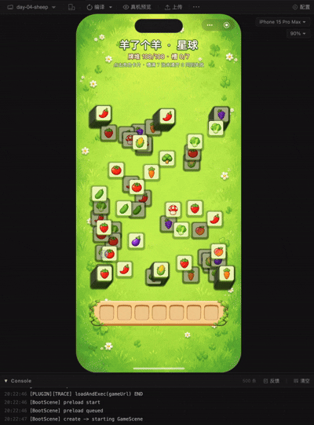
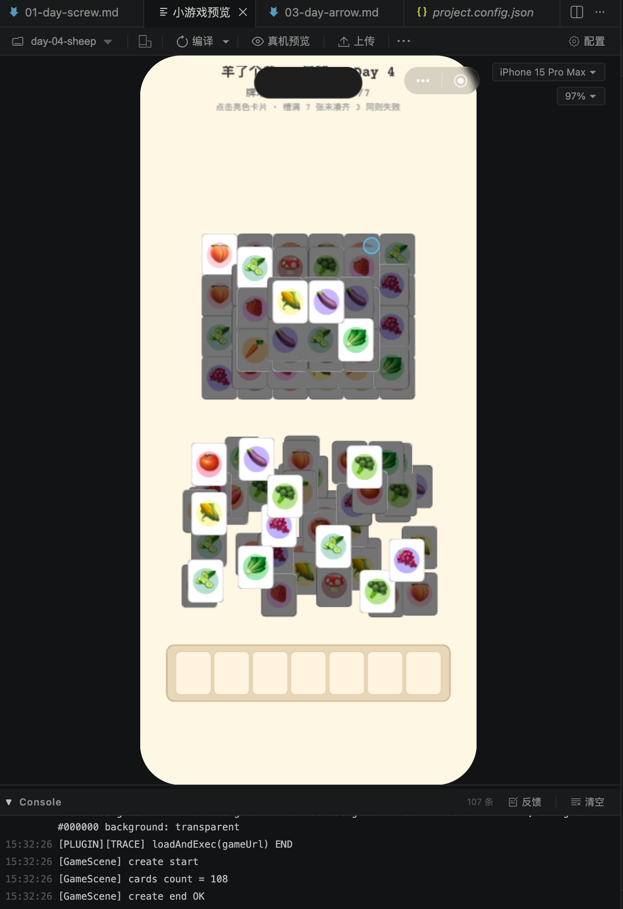
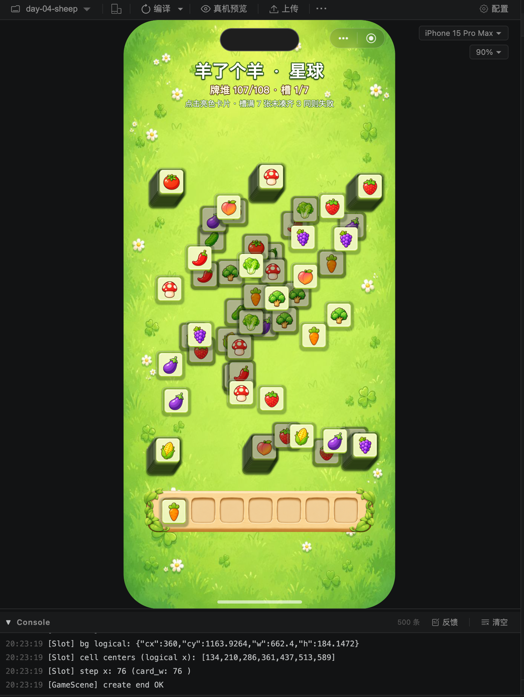

# 用AI每天复刻一个微信小游戏 · Day 4：羊了个羊星球

> 作者：xiaofengguo · 2026-05-28 · 系列 Day 4

---

## 〇 写在前面

Day 4 原计划做《箭头会拐弯》。但真正准备动手时，我发现这个游戏和 Day 3 的《一箭又一箭》核心玩法几乎是同一个东西：都是点阵网格、线段移动、碰撞失败、消除通关，只是名字不同而已，所以我决定跳过它，直接进入清单里的第五个游戏：**《羊了个羊星球》**。

这一天的开发很有意思。玩法逻辑实现得非常顺利，除了遮挡判断有一个小问题，很快就跑通了完整闭环。真正花时间的是后半段：AI 生成图片、抠图、去白边、卡片清晰度、卡槽比例、槽位坐标、阴影质感、刘海安全区……这些看起来不像“编程”的细节，反而占了今天的大部分时间。



---

## 一 游戏介绍

《羊了个羊星球》是一款叠牌三消小游戏，玩法可以用一句话概括：**从一堆互相遮挡的卡片里点击没有被压住的卡，放到底部 7 格卡槽里，凑齐 3 张同类型就消除，卡槽满了还没消掉就失败。**

具体规则很简单：

- 场上有多层卡片，每张卡片都有一种图案
- 被上层卡片遮住的卡片不能点击，只有完全露出来或基本没被遮住的卡片可以点击
- 点击后卡片飞到底部卡槽
- 卡槽最多放 7 张
- 同类型卡片会自动靠在一起
- 连续 3 张同类型卡片立即消除
- 牌堆清空则胜利，卡槽满 7 张还没凑出三消则失败

这个玩法最关键的不是三消，而是**遮挡顺序 + 卡槽容量**。你不能只看当前能点什么，还要预判：点进去之后会不会占死卡槽，能不能尽快凑出三张，下面被压住的卡什么时候能解出来。

---

## 二 过程记录

### 2.1 第一步：先把基础玩法跑起来

这次我一开始给的是比较完整的目标，重点是复刻羊了个羊类的核心逻辑，而不是先做复杂美术。

**我的关键输入大意：**

> 因为箭头会拐弯和一箭又一箭核心玩法基本上一模一样，所以我们本期主要来复现第五个游戏，但是仍然是day4的复现，羊了个羊 星球。
> 羊了个羊 星球是一个非常经典的三消游戏，它的主要玩法为：
> 1. 主要游戏区域有多个堆叠的蔬菜/物品方形卡片，卡片之间会互相堆叠，并且会产生遮挡，有点类似于我们day1复刻的打个螺丝的板子，只有遮挡面积较小的方块是亮的，可以被点击。（遮挡面积较小，小于5%，也可以被点击）
> 2. 主要的游戏区域有很多卡片的堆叠，我们直接生成比较难的版本，卡片数量设定为非常多，并且有两种模式，一种随意堆叠，一种整齐堆叠（类似牌堆）
> 3. 下方有一个卡片槽，被点击的卡片会进入卡片槽，卡片槽最多可以放7个卡片，并且会自动排序，后来的卡片如果槽里面已经有相同的卡片了，会自动插入到之前相同 的卡片后面。当有三个相同的卡片的时候，会消除，然后其余卡片左移。
> 4. 可解性判断，这边不需要做可解性判断，可以通过卡片种类控制整体难度。
> 参考第一天打个螺丝的实现，玩法比较类似，同时使用我们总结的两个Skill：phaser-weixin-minigame、weixin-minigame-dev，来进行游戏开发，使用我们沉淀的经验。引擎还是使用Phaser，我们先用代码生成素材占位，基本逻辑实现之后再使用AI生成的素材，还是一样，你先进行调研，生成一份调研文档放在doc目录。

AI 从前几天已经沉淀好的 Phaser 微信小游戏模板开始，直接搭了一个新目录 `day-04-sheep/`。这一步基本没什么波折，核心文件很快成型：

- `js/core/config.js`：统一管理卡片数量、槽位数量、尺寸、动画时间
- `js/core/LevelGenerator.js`：生成 108 张卡片的随机布局
- `js/scene/GameScene.js`：负责渲染、点击、入槽、消除、胜负判定

第一版采用的是程序化图形：米色背景、白色卡片、简单水果图标、灰色遮挡层。视觉当然还很粗糙，但玩法闭环已经有了。



这版实现了几个基础规则：

**牌堆生成**：12 种类型，每种 9 张，总共 108 张。每种数量都是 3 的倍数，保证理论上都可以被消掉。

**卡槽逻辑**：底部 7 个槽位，点击卡片后飞入卡槽。同类型卡片不是简单追加到末尾，而是会插入到同类型卡片后面，这样更接近原游戏的体验，也更容易形成三消。

**三消逻辑**：卡槽中连续出现 3 张同类型，立即缩小淡出，然后后面的卡片左移补位。

**胜负判定**：牌堆清空就是胜利；卡槽达到 7 张且没有触发消除，就是失败。

基础玩法这次比前两天顺很多。Day 1 的规则理解、Day 2 的物理碰撞、Day 3 的动画系统都曾经反复折腾；但 Day 4 这类玩法本质上是状态机 + 坐标计算，Phaser 已经足够用了，不需要物理引擎，也没有特别复杂的动画。

---

### 2.2 第二步：关卡布局，从“上下两块”改成混合牌堆

第一版虽然能玩，但牌堆看起来不像羊了个羊。它更像上下分成两块：上面一坨、下面一坨，中间关系不强。

我反馈的核心意思是：**不要分区，要像真实牌堆一样混在一起，有几摞整齐叠牌，也有散落的卡片。**

于是关卡生成器改成了“整齐小摞 + 散卡”的混合结构：

- 6 个小牌摞，每摞 10 张，共 60 张
- 剩下 48 张作为散卡随机分布
- 每摞内部每张牌有 2-3px 的微小偏移，看起来像一摞扑克牌
- 散卡和牌摞共享同一个 z 空间，不是简单分层摆放
- zLayer 随机错开，让摞与摞之间、散卡与摞之间都有穿插遮挡

这个改动很关键。羊了个羊类游戏的视觉不是“很多独立卡片散在屏幕上”，而是要有一种**一摞一摞压在一起、又散落穿插的感觉**。如果布局太平均，就没有“解牌”的感觉；如果全堆在一起，又会太混乱。

现在的 `LevelGenerator.js` 里，牌堆区域会避开顶部 HUD 和底部卡槽，中间铺一个粗网格生成 6 个 anchor，每个 anchor 对应一摞牌。散卡再在同一区域随机抖动分布。这样最终看起来更像一堆牌，而不是两个矩形区域。

---

### 2.3 第三步：遮挡判断的小坑

今天唯一比较像“玩法 bug”的问题，是遮挡判断。

最初的逻辑是按 zLayer 判断：如果上层卡片和当前卡片有重叠，当前卡片就变暗不可点。这个思路没错，但细节上有两个问题。

第一个问题是：**同一 zLayer 内也有绘制顺序。**

Phaser 渲染时不只是看 zLayer。我们实际绘制卡片时，同 zLayer 内还按 id 排序，所以同一个 zLayer 中，后绘制的卡也会压住前绘制的卡。如果遮挡判断只看 `zLayer > current.zLayer`，就会漏掉同层但后绘制的遮挡关系。

第二个问题是：**多个上层卡片的遮挡面积不能简单相加。**

如果两张上层卡片自己有重叠，它们压住底牌的区域也可能重叠。简单把相交面积相加，会把同一块区域算两遍，导致一些其实只被遮住一点点的卡片被误判成不可点。

最后修成了两个规则：

- “谁在上面”必须和真实绘制顺序一致：先比 `zLayer`，同层再比 `id`
- 遮挡面积要算多个矩形的**联合面积**，而不是面积求和

实现上用了一个小的坐标压缩网格法来算矩形并集面积。卡片面积的 5% 作为阈值，小于这个阈值就认为可以点击。这样可以避免因为边缘压到一点点就把卡锁死，也更接近实际游戏体验。

这个问题修完之后，基础玩法就比较稳定了。

---

### 2.4 第四步：开始接 AI 生成图片

基础逻辑跑通后，真正耗时的部分开始了：接入 AI 生成图片。

这次需要的素材比 Day 2 更多：

- 一张草地背景
- 12 个蔬菜/水果图标
- 一张卡片底框
- 一张底部卡槽图

这次生图用的是 `gpt-image-2`。我没有直接把英文提示词贴进去，而是统一整理成中文，方便后面回看自己当时到底想要什么。

**草地背景：**

> 生成一张竖版手机小游戏背景图，主题是明亮清新的草地星球，整体偏绿色和浅黄色，画面中有细碎草纹、三叶草、小白花和柔和光斑。不要出现人物、文字、按钮、卡片或明显主体。画面上下需要留出 UI 空间，中间区域适合摆放大量卡片。风格要可爱、柔和、适合微信小游戏，高清，细节丰富但不要太杂乱。

**蔬菜/水果图标：**

> 生成一个可爱的卡通草莓图标，单个主体，正面视角，色彩鲜艳，边缘清晰，带轻微高光和阴影，适合放在方形游戏卡片中。纯白背景，不要文字，不要边框，不要其他物体。
>
> 生成一个可爱的卡通番茄图标，单个主体，正面视角，色彩鲜艳，边缘清晰，带轻微高光和阴影，适合放在方形游戏卡片中。纯白背景，不要文字，不要边框，不要其他物体。

> 后面替换图标名称，其它都一样

**卡片底框：**

> 生成一个正方形的可爱游戏卡片底框，圆角矩形，浅黄绿色内底，外圈有柔和绿色描边和轻微厚度感。卡片中间留空，用来放蔬菜水果图标。整体干净、高清、边缘清晰、适合休闲消除游戏。纯白背景，不要文字，不要图标，不要阴影投到背景上。

**底部卡槽：**

> 生成一个横向的 7 格游戏卡槽 UI，木质浅黄色底座，每个槽位是圆角凹槽，两侧有绿色藤蔓和叶子装饰。整体风格可爱、清新、适合羊了个羊类小游戏。正面视角，高清，边缘清晰。纯白背景，不要文字，不要额外按钮。

AI 生图本身并不难，gpt-image-2生成的图片质量相当高，有足够约束的情况下风格和内容是基本可用的，但是问题是**AI 生成的图片经常不是游戏资产**。

最典型的问题是：它会把主体画在纯白背景上。人眼看起来没问题，但放到游戏里就会露出白底、白边、灰边、抗锯齿污染。水果和蔬菜这种主体相对独立的图片还好处理，卡片底框和卡槽这种 UI 资产就麻烦很多。

水果/蔬菜图标的处理流程基本延续了 Day 2 的经验：

1. 从白底图中切出单个图标
2. 用阈值把白色背景变透明
3. 根据 alpha bounding box 自动裁剪
4. 居中缩放到统一尺寸
5. 接入 Phaser 后强制按卡片比例显示

这一部分做得比较顺。因为水果蔬菜的主体边界清晰，内部颜色也比较饱和，抠白底之后基本不会伤到主体。

---

### 2.5 第五步：卡片底框和卡槽，比水果难处理得多

真正麻烦的是卡片底框和卡槽。

一开始处理卡片底框时，我发现卡片边缘有白边，而且放在绿色草地背景上特别明显。卡槽也一样，叶子装饰和木板边缘周围会残留一圈白色或浅灰色。

我当时的反馈大概是：**背景和水果处理得很好，但卡槽和卡片底框处理比较差。**

这个问题的根源是：AI 生成 UI 资产时，边缘并不是干净的透明像素，而是白色背景和主体颜色混合后的抗锯齿像素。简单把纯白变透明，只能去掉背景，去不掉边缘混进去的白色。

这里也要说一下真实情况：脚本去纯色背景是有局限的。水果和蔬菜这种主体比较独立的图片，脚本处理起来还算顺；但卡片底框和卡槽这种 UI 图片，边缘有装饰、有高光、有半透明过渡，脚本很容易要么删不干净，要么把主体边缘也伤掉。

所以今天最终版本里，卡片底框和卡槽的背景去除，并不是完全靠 Python 脚本自动完成的，而是我在第三方工具里手动去掉背景之后，再拿回项目里继续调尺寸、比例和位置。

中间也尝试过把脚本往更稳的方向改：

**第一步：从四个边缘 flood-fill 白色背景。**

不是全图把白色都删掉，而是只删除“和图片边缘连通的白色区域”。这样可以保留卡片内部本来就很亮的高光、米黄色内框，不会误删主体。

**第二步：清理内部小白块。**

有些白色区域被叶子或装饰包住，不和外部背景连通，flood-fill 删不掉。脚本会再扫描小面积白色孤岛，把这些残留删掉。

**第三步：边缘去污染。**

对于半透明边缘像素，把 RGB 往附近不透明主体像素的颜色拉，而不是继续保留偏白的 RGB。这样合成到草地上时，就不会出现一圈白边。

**第四步：专门处理 halo。**

卡槽两侧叶子下面有一些浅色碎片，前几步仍然抓不干净。最后加了一个“靠近透明区域的浅色像素删除”逻辑，只处理紧贴透明边缘的浅色像素，避免伤到木板内部。

这套逻辑目前还只能算探索版，已经能处理一部分典型白底图，但离“丢进去就自动得到干净游戏资产”还差一截。后面如果继续优化 Python 脚本，把 UI 边缘去污染、半透明像素重建、主体保护这些问题处理好，图片处理效率会提高很多。

---

### 2.6 第六步：清晰度问题，不能只看图片本身

接入图片后，又遇到一个视觉问题：卡片看起来糊，卡槽也不够清晰。

这个问题一开始很容易误判成“图片生成得不够清楚”。但实际排查下来，不只是素材问题，还有显示尺寸的问题。

卡片在游戏里的逻辑尺寸是 76×76，如果源图只有接近这个尺寸，再缩放和抗锯齿之后就会显糊。后来卡片底框统一处理成 256×256，再在游戏里显示为 76×76，相当于高分辨率素材缩小显示，边缘会明显更干净。

图标也是类似的思路：保留足够高的源分辨率，进游戏后按卡片尺寸缩小，而不是用低分辨率图硬放大。

这个经验其实很简单：**小游戏里的素材要按显示尺寸的 2x 或 3x 准备，不能刚好等于显示尺寸。**

---

### 2.7 第七步：卡片阴影，不是半透明描边

卡片接入真实底框后，我又觉得它和草地背景贴在一起，没有层次。

我给过一轮比较明确的反馈：

**我的输入（原文）：**

```
清晰度变高，卡槽位置也对上了，但是问题在于：
边框效果：我的意思是你加上类似于边框阴影之类的，能够反向衬托卡片的，灰色渐变消失那种有质感的效果，不是向现在这种半透明的边框
```

第一版修改加了阴影，但又有点过了：卡槽也被加了阴影，卡片右下角阴影太重，看起来像一个固定方向的黑块。

我继续反馈：

**我的输入（原文）：**

```
卡槽不需要加阴影，其次，卡片的阴影为什么右下角大，有点怪，而且颜色可以稍微再淡一点
```

最后的方案是：

- 卡槽不加额外阴影，保持原图
- 卡片只保留很轻的外扩柔光
- 阴影不明显向右下偏移，只给一点点下沉感
- 颜色用偏草绿色的暗部，而不是纯黑
- 再加一条很淡的左上内高光，让卡片有“上釉”的感觉

这个细节看起来小，但对质感影响很大。半透明描边会显得廉价，多层柔和投影才更像真正贴在背景上的卡片。

---

### 2.8 第八步：卡槽图换了，槽位坐标必须重新测

卡槽是今天另一个反复调的地方。

一开始卡槽图显示被压缩，是因为沿用了旧图的宽高比。新图实际尺寸是 2000×556，宽高比大约是 3.597:1，不再是旧图的比例。这个问题很好修：配置里按新图真实宽高比显示即可。

但比例修好后，又出现了新问题：卡片放进槽位时和凹槽有偏移。

我的反馈是：

**我的输入（原文）：**

```
新的卡槽没有压缩了，但是和放置上去的卡片有一定偏移，你看一下历史记录，历史上应该专门拿旧图计算出了每个槽的位置坐标，新图可能对不太上了，需要重新计算校准，另外顶部的文字还是被挡住了，还要再往下一点
```

这里的关键是：**卡槽图不是一个简单的 7 等分矩形。**

视觉上的 7 个凹槽在 PNG 里的位置，取决于图片本身的绘制。两侧叶子、木板边缘、内边距都会影响第一个凹槽和最后一个凹槽的位置。如果只是按整张图平均切 7 份，肯定会偏。

所以最后写了一个 `_measure_slot.py` 脚本，直接扫描 `slot_bg.png` 的像素：

1. 找到卡槽竖直中线附近的几条扫描线
2. 根据米黄色凹槽的颜色范围，识别出 7 段连续区域
3. 计算每段的中心 x
4. 把第一个凹槽中心、最后一个凹槽中心、凹槽内部宽度都换算成相对整图宽度的比例

最后写回配置：

```js
export const SLOT_BG_ASPECT = 2000 / 556;
export const SLOT_BG_LEFT_CX_RATIO = 0.1583;
export const SLOT_BG_RIGHT_CX_RATIO = 0.8460;
export const SLOT_BG_INNER_CELL_RATIO = 0.0834;
```

游戏里再根据这两个中心比例插值出 7 个槽位中心。对这次 Demo 来说，卡片已经能落到 PNG 真实凹槽的中心，看起来不再别扭。

但这里其实还有隐患。现在这个版本只是把当前分辨率、当前卡槽图下的坐标对齐了；如果切换设备、切换分辨率，或者后面把卡槽缩放策略改掉，表现未必一直稳定。

真正不是 Demo 的做法，应该把卡槽拆成独立的游戏对象：背景、7 个槽位、两侧装饰分别管理，槽位坐标由对象自身的布局系统计算，而不是只依赖一张 PNG 上测出来的比例。这样才能更好地做自适应，也方便以后加动画、状态变化和点击反馈。

这和 Day 2 测量背景漏斗边界是同一个思路：**不要凭感觉手调坐标，先从图片像素里反推一个可用配置；但如果要做成正式产品，还要继续把它对象化、模块化。**

---

### 2.9 第九步：刘海安全区和顶部文字

最后一个细节是顶部文字。

iPhone 15 Pro Max 的模拟器里，标题正好被刘海遮住。第一次下移后还是不够，后面继续把 HUD 的安全距离加大。

现在配置里 `HUD_HEIGHT = 230`，并且 `GameScene` 里又给 HUD 文本加了 `hudSafeOffset`，标题、状态条、提示文案整体往下移。与此同时，牌堆生成区域也会从 `HUD_HEIGHT + 30` 开始，避免文字下移后又压到牌堆。

这个问题也提醒了一点：**竖屏小游戏不能只看逻辑画布，要真实放到带刘海的设备里看。** 尤其是微信小游戏顶部还有胶囊按钮，标题放得太靠上很容易被挡。



---

## 三 复刻成果

最终版本实现了《羊了个羊星球》的核心玩法闭环：

**核心玩法**：
- 108 张卡片，12 种类型，每种 9 张
- 多层混合牌堆：6 个小摞 + 48 张散卡
- 点击可用卡片飞入底部 7 格卡槽
- 同类型卡片自动插到一起
- 连续 3 张同类型立即消除
- 卡槽满 7 张失败，牌堆清空胜利

**遮挡判断**：
- 与真实绘制顺序一致：`zLayer` + `id` 决定谁压住谁
- 多张卡片遮挡时计算联合面积，避免重复计数
- 5% 遮挡阈值，减少边缘轻微覆盖造成的误锁

**视觉效果**：
- AI 生成草地背景
- AI 生成 12 种蔬菜/水果图标
- 处理后的卡片底框与底部卡槽
- 多层柔和卡片阴影 + 左上高光
- 卡槽图按真实宽高比显示，槽位中心由像素扫描校准

**没做的部分**：道具系统、关卡难度曲线、洗牌/撤回、音效、正式的新手引导。这些不是今天的重点，Demo 阶段先不展开。

---

## 四 今天沉淀的主要内容

### 4.1 羊了个羊类玩法实现模式

这类游戏的代码难度不高，但有几个点必须做对：

- **遮挡判断要和绘制顺序一致**：不能只看 zLayer，还要看同层绘制顺序
- **遮挡面积要算并集**：多张上层卡片重叠时，不能简单相加
- **卡槽插入要聚合**：同类型插到一起，才能接近原游戏体验
- **消除后要压缩补位**：三消动画结束后，后续卡片左移补齐
- **牌堆生成要有“摞”的感觉**：纯随机散布不像羊了个羊，必须有小牌摞和散卡混合

这套逻辑以后做类似“叠牌 + 底槽三消”的游戏可以直接复用。

### 4.2 AI 图片处理经验

今天最主要的沉淀其实不是玩法，而是 AI 图片处理。

AI 生成的图片，经常需要经历从“好看的图”到“可用的游戏资产”的二次加工：

1. **白底转透明**：不能全图阈值删除，要从边缘 flood-fill，只删背景
2. **保留内部高光**：卡片、木板、槽位内部本来就有浅色，不能误删
3. **清理白边和 halo**：抗锯齿边缘的 RGB 往往被白底污染，需要去污染
4. **统一尺寸和比例**：卡片底框必须是正方形，卡槽必须保持真实宽高比
5. **像素反推坐标**：卡槽、漏斗、边界这类图片结构，最好用脚本测量，不要手调
6. **高分辨率缩小显示**：素材不要刚好等于显示尺寸，至少按 2x 准备

不过今天也暴露了一个问题：图片处理脚本还不够成熟。水果和蔬菜能比较顺地自动处理，卡片底框和卡槽最后还是靠第三方工具手动去背景。这个地方后面值得继续投入，真把脚本打磨好之后，后续接 AI 素材会省很多时间。

这些经验已经沉淀成了 `ai-image-handle` Skill。尤其是卡片底框和卡槽这类 UI 资产，比水果图标更容易出问题，下次应该提前按这套流程处理，也要提前预留手动修图的时间。

### 4.3 更新了微信小游戏开发经验

今天也把羊了个羊类玩法的经验更新到了微信小游戏开发 Skill 里，主要包括：

- 叠牌游戏的遮挡判定方式
- 多卡遮挡联合面积计算
- 卡槽位置从图片像素反推
- 换图后必须重新扫描槽位比例
- 刘海安全区与微信胶囊按钮的避让
- 图片清晰度要同时检查素材分辨率和渲染尺寸

这些都是非常实际的开发经验，不是某一个项目的临时修补。

---

## 五 一点思考

### AI 写玩法逻辑已经很顺了

今天最明显的感受是：**AI 实现基础玩法越来越顺。**

Day 1 的规则理解有偏差，Day 2 被物理引擎折腾很久，Day 3 卡在动画系统。但到了 Day 4，只要玩法描述清楚，AI 很快就能把状态机写出来：牌堆、点击、入槽、三消、胜负判定，基本都没有太大问题。

唯一需要人类介入的是“感觉不对”的地方，比如遮挡判断。AI 第一版会写一个看起来合理的 zLayer 判断，但玩家一看就知道：这张牌明明被压住了，为什么还能点？或者这张牌只被盖了一点点，为什么完全暗掉？

这类问题不是代码语法问题，而是玩法体验问题。AI 能很快修，但需要人先指出“哪里不对”。

### 图片处理会成为小游戏复刻里的高频问题

今天真正花时间的是图片。

这让我意识到，AI 做小游戏时，未来的瓶颈可能不在“写代码”，而在“把图片变成游戏资产”。

AI 生图给你的往往是一张漂亮图片，不是规范资产。背景可能有透视，主体可能带白底，边缘可能有光晕，UI 组件可能不是标准比例，槽位位置也不一定均匀。要把它放进游戏里，需要大量二次处理。

水果、蔬菜这种图标还好，规则简单：抠出来、裁剪、缩放即可。但卡片底框、卡槽、通道、按钮这类 UI 图片更麻烦，因为它们既有装饰，又有功能坐标。图片本身的某些像素位置，会直接决定游戏里的碰撞区域、槽位中心、点击区域。

所以后续做 AI 小游戏，不能把“图片处理”当成最后接素材那一步。它应该提前进流程：先想清楚图片会不会参与坐标计算，能不能自动抠干净，哪些地方需要拆成对象，哪些地方只能先手动修。

### 像素测量比手调坐标可靠

Day 2 测过漏斗边界，Day 4 又测了卡槽凹槽中心。两次都证明：**只要图片里有明确结构，先用脚本量一遍，比直接靠肉眼调靠谱。**

但这次也让我有点担心：测出来的比例，只能保证“这张图在这套缩放方式下”是对的。换设备、换分辨率、换一张新的卡槽图，都可能重新出问题。

所以像素测量更适合用在两个场景里：一个是 Demo 阶段快速校准，另一个是正式开发前的资产分析。真要长期维护，还是应该把卡槽、按钮、碰撞区这些东西拆成游戏对象，用布局系统去保证自适应，而不是把所有东西通过坐标对齐。

---

## 六 下一步

Day 5 准备做《抓大鹅》。这个游戏和前几天都不太一样，核心不再是单纯的移动、碰撞或叠牌，而是更偏搜索、收集和空间整理。正好可以看看 AI 在这种玩法上会不会踩新的坑。

现在基础设施已经比较稳定：Phaser 模板、微信小游戏预览、截图反馈、AI 图片处理、像素测量脚本都已经有了。接下来更想继续观察两个方向：

- 一个是更复杂的关卡生成，比如带难度曲线、可解性约束、引导节奏
- 另一个是更完整的美术资产流程，比如角色动画、按钮状态、场景切换

今天的复刻就到这里了，明天继续～

---

*系列仓库：[github.com/IcedSoul/minigame-everyday](https://github.com/IcedSoul/minigame-everyday)*
