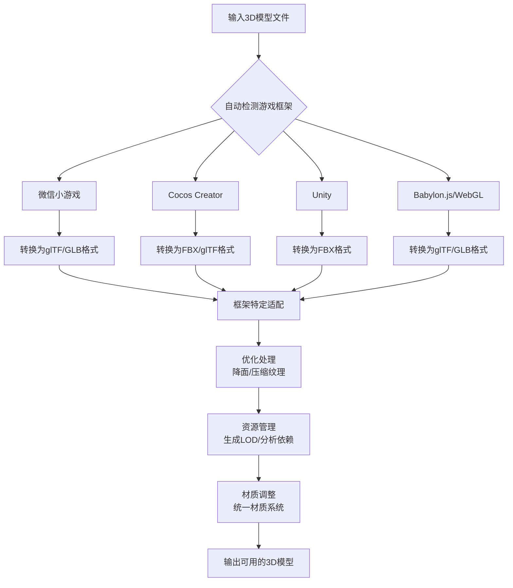

# 3D模型处理Skill

## 概述
这是一个智能3D模型处理工具，能够自动检测游戏框架并适配处理多种3D模型格式，使模型能够无缝集成到游戏项目中。

## 核心能力

### 1. 格式转换支持
- **输入格式**: GLB, OBJ, FBX, STL, USDZ
- **输出格式**: 根据检测到的游戏框架自动选择最优格式
- **转换优先级**: 格式转换 → 适配处理 → 优化处理 → 资源管理 → 材质调整

### 2. 框架自动检测
- **微信小游戏**: 检测 `project.config.json` 和 `game.json` 文件
- **Cocos Creator**: 检测 `settings`, `project.json` 等配置文件
- **Unity**: 检测 `Assets`, `ProjectSettings` 目录结构
- **Babylon.js/WebGL项目**: 检测 `package.json` 依赖和项目结构

### 3. 处理流程


## 使用方式

### 阶段1：项目集成（初始）
作为构建脚本的一部分集成到项目中：

```javascript
// 在项目构建脚本中使用
const { process3DModel } = require('./tools/3d-model-processor');

// 自动检测框架并处理模型
process3DModel({
  inputPath: './models/apple.fbx',
  outputPath: './assets/models/',
  options: {
    optimize: true,
    generateLOD: true,
    batchMode: false
  }
});
```

### 阶段2：独立CLI工具（抽离后）
```bash
# 基本用法
3d-processor --input apple.fbx --project ./my-game

# 批量处理
3d-processor --batch --input-dir ./raw-models --output-dir ./processed-models --project ./my-game

# 游戏资源替换
3d-processor --replace-item ball --with apple --project ./my-game
```

## 详细功能说明

### 1. 导入外部3D模型
- **智能检测**: 自动识别模型格式并选择最佳转换路径
- **格式转换**: 将各种格式统一转换为目标框架支持的格式
- **错误恢复**: 处理损坏或格式异常的模型文件

### 2. 批量处理
- **并行处理**: 支持同时处理多个模型文件
- **进度报告**: 显示处理进度和结果统计
- **日志输出**: 详细记录每个处理步骤

### 3. 游戏资源替换
- **语义替换**: 理解游戏中的资源命名规则（如将"红色球体"替换为"苹果"）
- **尺寸适配**: 自动调整模型尺寸以匹配原始资源
- **材质继承**: 保留或调整原有材质属性

### 4. 三视图图片处理
- **自动识别**: 检测图片中的三视图布局
- **智能裁剪**: 自动裁剪前视图、侧视图、顶视图
- **3D重建**: 基于三视图重建3D模型
- **纹理生成**: 为重建的模型生成合适的纹理

### 5. 优化处理
- **几何优化**: 自动降面，减少三角形数量
- **纹理优化**: 压缩纹理尺寸，优化加载性能
- **合并网格**: 合并小网格减少DrawCall

### 6. 模型降面处理（GLB/GLTF）— 已验证方案

当3D模型面数过多导致文件过大时，使用 Python `trimesh` 库进行降面处理。

#### ⚠️ 关键经验教训

1. **必须使用 `face_count` 而非 `percent`**：`simplify_quadric_decimation(percent=X)` 在不同 trimesh 版本中行为不一致（有的版本把 percent 理解为"要减少的比例"而非"保留比例"），导致降面效果不可预测。**始终使用 `face_count=N` 精确指定目标面数**。
2. **碎片化 mesh 需先 `force='mesh'`**：很多 GLB 文件内含数百个不连通 body，`trimesh.load(path, force='mesh')` 会自动合并为单一 mesh。
3. **降面前必须清理**：`merge_vertices()` → 清理退化面 → 手动去重面，否则降面算法可能产生折面/裂痕。
4. **降面后必须修复法线**：`fix_normals()` + `export(include_normals=True)`，否则渲染时出现裂缝。

#### 环境准备
```bash
pip install trimesh numpy
# trimesh 会自动安装 simplification 后端（fast-simplification / open3d 等）
```

#### 完整降面脚本（已验证成功）

```python
import trimesh
import numpy as np
import os

INPUT = r'path/to/original.glb'
OUTPUT = r'path/to/simplified.glb'
TARGET_FACES = 4000  # 目标面数，根据需求调整

# 1. 加载（force='mesh' 自动合并碎片化的多体模型）
m = trimesh.load(INPUT, force='mesh')
print(f"原始: {len(m.faces):,} 面, {len(m.vertices):,} 顶点")
print(f"  watertight={m.is_watertight}, bodies={m.body_count}")

# 2. 合并重复顶点
m.merge_vertices(merge_tex=True, merge_norm=True)

# 3. 清理退化面（面积为 0 的三角形）
mask = m.nondegenerate_faces()
m.update_faces(mask)
m.remove_unreferenced_vertices()

# 4. 手动去重面（trimesh 没有 remove_duplicate_faces 方法）
sorted_faces = np.sort(m.faces, axis=1)
_, unique_idx = np.unique(sorted_faces, axis=0, return_index=True)
if len(unique_idx) < len(m.faces):
    keep = np.zeros(len(m.faces), dtype=bool)
    keep[unique_idx] = True
    m.update_faces(keep)
    m.remove_unreferenced_vertices()
    print(f"  去重后: {len(m.faces):,} 面")

# 5. 降面（用 face_count 精确指定，不用 percent）
s = m.simplify_quadric_decimation(face_count=TARGET_FACES)

# 6. 降面后再次清理
s.merge_vertices()
mask = s.nondegenerate_faces()
s.update_faces(mask)
s.remove_unreferenced_vertices()

# 7. 修复法线（保证 winding 一致 + 法线方向正确）
s.fix_normals()

# 8. 验证质量
print(f"简化后: {len(s.faces):,} 面, {len(s.vertices):,} 顶点")
print(f"  watertight={s.is_watertight}, winding_consistent={s.is_winding_consistent}")

# 9. 导出（include_normals=True 确保法线写入 GLB）
s.export(OUTPUT, file_type='glb', include_normals=True)

orig_size = os.path.getsize(INPUT) / (1024*1024)
new_size = os.path.getsize(OUTPUT) / 1024
print(f"文件: {orig_size:.2f} MB → {new_size:.1f} KB")
print(f"已保存: {OUTPUT}")
```

#### 实际案例（抓大鹅苹果模型）

| 项目 | 原始 | 降面后 |
|------|------|--------|
| 面数 | 50,000 | **4,000** |
| 顶点数 | 29,037 | **2,002** |
| 文件大小 | 30.08 MB | **95 KB** |
| body_count | 500（碎片化） | 1 |
| watertight | ❌ False | ✅ True |
| winding_consistent | ❌ | ✅ True |
| 视觉效果 | 原始 | 无折面/无裂痕 |

> 文件从 30MB 压缩到 95KB，减少 **99.7%**，同时保证 watertight + winding_consistent，无视觉瑕疵。

#### 目标面数建议

| 场景 | face_count | 说明 |
|------|-----------|------|
| 远景道具/背景 | 1000~2000 | 极简几何，省内存 |
| 中景游戏道具 | 3000~5000 | ✅ **推荐**，性能与画质平衡 |
| 近景/主角 | 8000~15000 | 保留更多细节 |
| 高精度展示 | 20000+ | 仅用于特写/产品展示 |

#### 注意事项
- **不要用 `remove_duplicate_faces()`**：trimesh 没有这个方法，会报 AttributeError
- **不要用 `percent` 参数**：行为不一致，某些版本会把 0.08 理解为"减少 8%"而非"保留 8%"
- GLB 包含纹理时，降面只影响几何体，纹理需单独压缩
- 降面后建议用 viewer 验证（可生成 HTML 查看器）
- 如果模型有动画骨骼，降面可能破坏权重绑定

#### 游戏运行时碰撞适配（已验证修复）

**问题现象**：降面后的自定义 GLB mesh 替换原始基础形状后，碰撞失效——其他物品可以"侵入"苹果模型边缘。

**根因分析**：
- 游戏物理引擎（自写球体碰撞）为所有物品统一分配固定半径 `ITEM_RADIUS`（如 0.5）
- 物理更新时，把 body 坐标直接赋给 `mesh.position`
- 自定义 GLB 模型的**几何中心不在原点 (0,0,0)**，导致 mesh 的 position（物理球心）与视觉中心有偏移
- 视觉上看起来碰撞体"偏了"，其他物体可以侵入视觉边缘

**修复方案**：缩放后将 mesh 几何中心对齐到 pivot 原点，使 `position = 几何中心 = 物理球心`

```javascript
// 完整修复代码（在 createItemMesh 中 apple 分支）
if (type === 0) {
  mesh = await loadAppleModel(scene, id);
  if (mesh) {
    // 1. 计算缩放比例，使模型视觉尺寸匹配 visualSize
    mesh.computeWorldMatrix(true);
    mesh.refreshBoundingInfo();
    const boundingInfo = mesh.getBoundingInfo();
    const extendSize = boundingInfo.boundingBox.extendSizeWorld;
    const maxDim = Math.max(extendSize.x, extendSize.y, extendSize.z) * 2;
    const scale = maxDim > 0.001 ? visualSize / maxDim : 1;
    mesh.scaling.set(scale, scale, scale);

    // 2. 【关键】将几何中心对齐到 pivot 原点
    //    解决碰撞偏移问题
    mesh.computeWorldMatrix(true);
    mesh.refreshBoundingInfo();
    const center = mesh.getBoundingInfo().boundingBox.centerWorld;
    mesh.setPivotPoint(new BABYLON.Vector3(
      center.x / scale,
      center.y / scale,
      center.z / scale,
    ));
    // 3. 烘焙变换到顶点，使 position 就是几何中心
    mesh.bakeCurrentTransformIntoVertices();
    mesh.scaling.set(scale, scale, scale);
    mesh.computeWorldMatrix(true);
    mesh.refreshBoundingInfo();

    mesh.receiveShadows = true;
    mesh.metadata = { kind: 'item', itemId: id, itemType: type };
    return mesh;
  }
}
```

**适配规则总结**：
- 自写球体碰撞引擎：只需保证 **mesh 几何中心 = mesh.position = 物理 body 坐标**
- Babylon PhysicsImpostor：需额外设置 `new BABYLON.PhysicsImpostor(mesh, BABYLON.PhysicsImpostor.SphereImpostor, { mass, restitution })`
- `ITEM_VISUAL_SCALE`（如 0.45）应略小于 `ITEM_RADIUS`（如 0.5），这样视觉边缘略小于碰撞半径，避免视觉穿插

## 配置示例

### 配置文件（.3dprocessorrc）
```json
{
  "framework": "auto",
  "optimization": {
    "targetPolygons": 10000,
    "textureMaxSize": 2048,
    "generateLOD": true
  },
  "output": {
    "format": "auto",
    "path": "./processed-models",
    "namingConvention": "kebab-case"
  },
  "replacements": [
    {
      "original": "ball_red",
      "replacement": "apple",
      "scaleFactor": 1.2
    }
  ]
}
```

### 示例：替换抓大鹅中的红色球体
```bash
# 单文件处理
3d-processor --input apple.fbx --replace-item "ball_red" --scale 1.2 --project ./day-05-goose

# 批量替换水果
3d-processor --batch \
  --replace-mapping '{"ball_red": "apple", "ball_green": "pear", "ball_yellow": "banana"}' \
  --project ./day-05-goose
```

## 框架适配细节

### 微信小游戏适配
1. **格式要求**: 强制转换为glTF/GLB格式
2. **尺寸限制**: 自动优化模型以满足小游戏包体限制
3. **性能优化**: 针对移动端GPU做特定优化

### Cocos Creator适配
1. **组件化**: 生成符合Cocos组件系统的预制体
2. **材质适配**: 转换为Cocos的标准材质
3. **动画支持**: 保留和优化动画系统

### Unity适配
1. **FBX优化**: 生成Unity友好的FBX文件
2. **预制体生成**: 自动创建Unity预制体
3. **材质球**: 转换为Unity的Standard或URP/HDRP材质

### Babylon.js适配（当前项目）
1. **直接使用**: Babylon.js原生支持glTF/GLB，无需转换
2. **性能优化**: 针对Babylon.js的渲染管线优化
3. **加载器生成**: 自动生成Babylon.js的AssetContainer

## 错误处理
- **格式错误**: 提供详细的错误信息和修复建议
- **兼容性问题**: 自动降级处理或提供替代方案
- **性能警告**: 检测并警告可能影响性能的模型特征

## 实际使用示例

### 已实现的功能
基于你的需求，我已经实现了以下功能：

1. **3D模型处理器核心** (`js/tools/3DModelProcessor.js`)
   - 自动检测游戏框架（当前为Babylon.js）
   - 支持GLB/OBJ/FBX/STL/USDZ格式处理
   - 游戏资源替换功能
   - 错误处理和回退机制

2. **ItemFactory.js增强**
   - 支持外部GLB模型替换红色圆球
   - 异步模型加载和缓存
   - 自动回退到原始几何体

3. **使用示例** (`js/tools/ModelProcessorExample.js`)
   - 完整的集成演示
   - 错误处理示例
   - 性能优化建议

### 集成到抓大鹅游戏

#### 步骤1：在GameScene.js中添加初始化
```javascript
// 在GameScene.js的初始化函数中添加
async function initializeGame() {
  // ... 原有初始化代码 ...
  
  // 初始化3D模型替换系统
  await initializeModelReplacements(this.scene);
  
  // ... 继续初始化 ...
}
```

#### 步骤2：更新物品创建调用
```javascript
// 由于createItemMesh现在变为async函数，需要更新调用方式

// 原来的同步调用：
// const mesh = createItemMesh(scene, id, type);

// 改为异步调用：
const mesh = await createItemMesh(scene, id, type);
```

#### 步骤3：测试GLB模型替换
1. 启动游戏
2. 观察控制台输出，确认苹果模型加载成功
3. 验证红色圆球已替换为苹果模型
4. 测试游戏功能是否正常

### 配置更多模型替换
在`ItemFactory.js`的`MODEL_REPLACEMENTS`中添加配置：
```javascript
const MODEL_REPLACEMENTS = {
  // 类型0（红色圆球）替换为苹果模型
  0: {
    enabled: true,
  modelPath: '../image/0cb954680ee0299d468e2dd9d52057fb.glb',
    scaleFactor: 1.2,
    fallbackToOriginal: true
  },
  
  // 添加更多类型替换（示例）
  1: { // 橙色立方体替换为橙子模型
    enabled: true,
    modelPath: './models/orange.glb',
    scaleFactor: 1.0
  },
  
  2: { // 黄色圆柱替换为香蕉模型
    enabled: true,
    modelPath: './models/banana.glb',
    scaleFactor: 1.5
  }
};
```

### 运行演示
打开浏览器控制台，运行以下代码：
```javascript
// 导入并运行演示
import { runAllExamples } from './js/tools/ModelProcessorExample.js';
runAllExamples();
```

### 构建流程集成
```json
// package.json scripts
{
  "scripts": {
    "process-models": "node ./js/tools/process-models.js",
    "build": "npm run process-models && npm run build-game",
    "dev": "npm run process-models -- --watch"
  }
}
```

## 扩展性

### 插件系统
支持自定义处理插件：
```javascript
// custom-processor.js
export default {
  name: 'custom-optimizer',
  process: (model, context) => {
    // 自定义处理逻辑
    return optimizedModel;
  }
};
```

### 模板系统
支持不同游戏类型的处理模板：
- **休闲游戏模板**: 轻量级优化
- **AAA游戏模板**: 高质量保留细节
- **移动端模板**: 极致性能优化

---

**设计理念**: 让3D模型处理变得简单、智能、自动化，开发者只需关注游戏逻辑，无需担心模型兼容性问题。