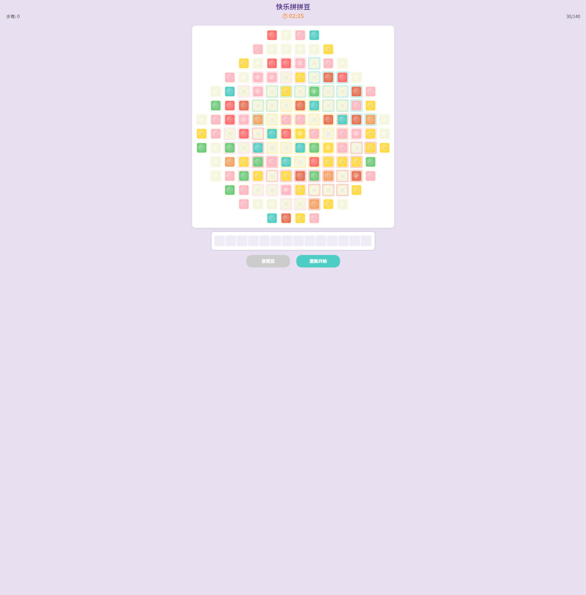
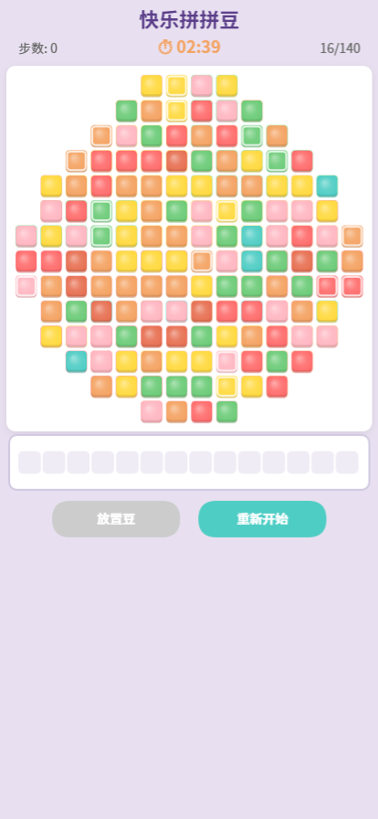
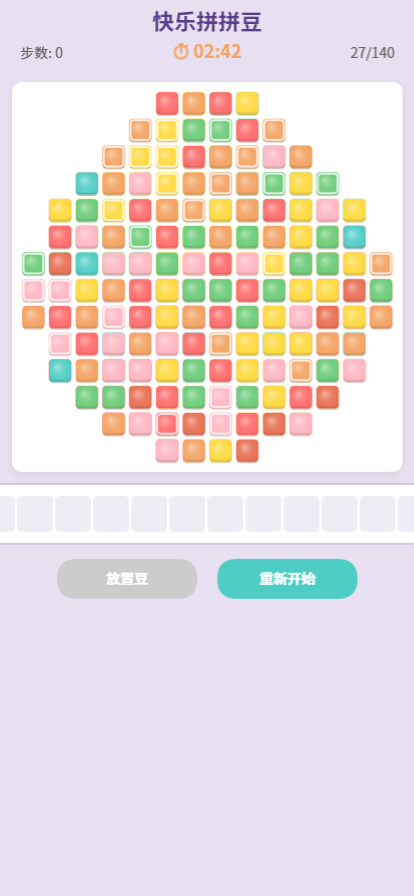
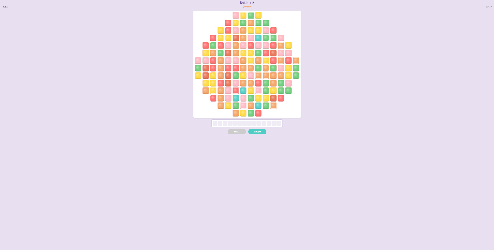
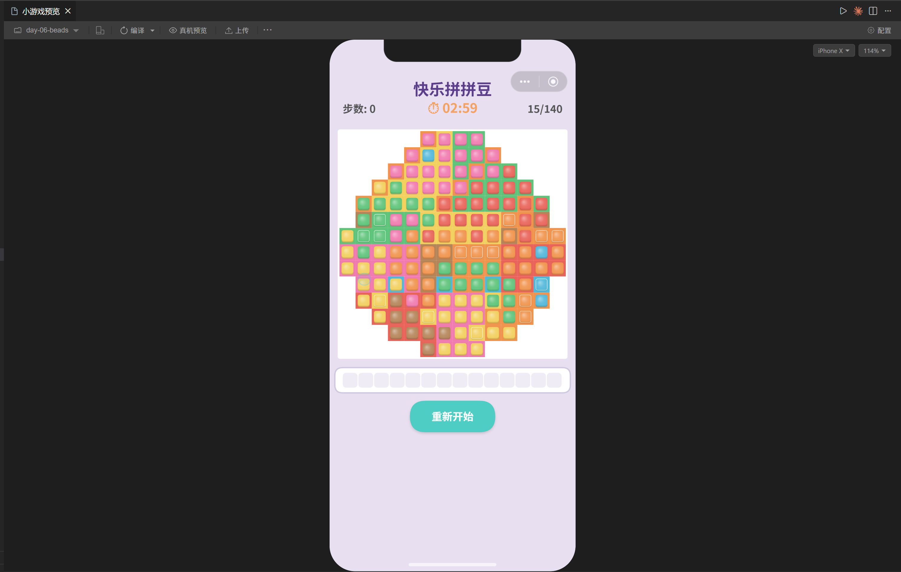

# Day 6 · 快乐拼拼豆 — 开发手记

## 技术选型：微信小游戏助手 + Canvas 2D 原生

这次直接用的**微信小游戏助手**来开发。好处很明显——不需要关心小游戏的工程配置、不需要手动写 `game.json` / `project.config.json` 那堆模板代码、不需要自己搭构建流程。对话框里描述需求，它直接生成可运行的代码，还能即时预览效果。

对于"快乐拼拼豆"这种纯 2D 网格拼图，核心就是画格子、画圆角方块、检测点击、播个位移动画。不涉及物理引擎、不需要 3D 渲染管线，Canvas 2D 原生 API 完全够用。

前 5 天一直在用 Babylon.js 做 3D 游戏，打包就 600KB+，还得写 adapter 适配微信沙箱。这次换成 Canvas 2D 原生，JS 总量 < 50KB，Tween 引擎自己写大概 100 行搞定。杀鸡不用牛刀。

整个开发流程就是：**描述需求 → 预览效果 → 反馈问题 → 迭代修改**，不用在 IDE 和模拟器之间来回切换，对话即编程。

---

## V1：先跑起来

按照 `实现方案.md` 的设计搭了基础骨架。14×14 不规则圆形图案、随机打散颜色、点击取豆→暂存→放回。

跑起来的第一版长这样：



问题一眼就能看到：
- 豆子完全打散，没有任何规律，玩起来无从下手
- 颜色太淡（当时用的莫兰迪色系），灰蒙蒙的
- HUD 文字和按钮太小，手机上根本看不清

---

## V2：四个核心问题

第一轮反馈直接丢了 4 个问题：

> 1. 豆太分散了，希望是能连续的豆子
> 2. 移除"放置豆"按钮，改成暂存槽选色→点击目标空位
> 3. 已匹配的豆不允许取出
> 4. 豆槽 border 加大，去掉间隙

### 问题1：区域生长算法

原来的颜色分配就是 Fisher-Yates 洗牌直接打散。改成区域生长后，每种颜色从 2~3 个随机种子点开始 BFS 扩展，形成大片连续区域。

有个小 trick：BFS 扩展时不是标准的先进先出，而是随机从队列中取元素，这样生长出来的形状更有机、更自然，不会是规则的矩形块。

```javascript
// 随机从队列中取（而不是 shift），让形状更有机
const qIdx = Math.floor(Math.random() * queue.length);
const idx = queue[qIdx];
queue.splice(qIdx, 1);
```

### 问题2：交互流程重写

这块花了几轮对话才确认清楚。关键对话：

> **我**：暂存槽的交互流程...放豆不再是"点击空位自动匹配"，而是需要先在暂存槽选择颜色，再点击目标空位？
>
> **用户**：是的

后来又追加了棋盘上豆也能"选中提起"的需求，还确认了选中规则是"同时匹配豆槽颜色+豆颜色"的连通区域（BFS 加了双条件过滤）。

### 问题3、4：简单但重要

已匹配锁定就一行判断。豆槽 border 加大则是把 `CELL_GAP` 从 3 改成 0，格子之间不留缝隙，用整格目标颜色填充当 border，豆画在中间内缩区域。

改完之后：



---

## V3：手机屏幕适配

拿到手机上一看：



文字糊成一团，按钮跟蚂蚁一样小，下面大片空白。

修复思路很直接：所有 UI 尺寸用 `baseUnit = canvasWidth / 375` 作基准等比缩放。375 是 iPhone 的逻辑宽度，这样不管什么设备都能保持合理比例。

同时加了双指缩放 + 拖拽功能，玩家可以放大看细节。手势状态机分三档：tap / pan / pinch，用移动距离和触摸点数量来判定。

---

## V4：颜色的四次迭代

颜色调了 4 次，这是整个项目里最"主观"的部分。

第一版用了高饱和卡通色（`#FFD700` `#FF4444`），太刺眼。改莫兰迪色系，太灰。减灰，还是灰。再减灰，终于到了"清亮但不刺眼"的平衡点。

最终配色：
```javascript
'#F2D05E', // 向日葵黄
'#E8645A', // 番茄红
'#5EC47A', // 青草绿
'#52B8D9', // 晴空蓝
'#F0944D', // 甜橙色
'#B5855A', // 太妃棕
'#F07BAF', // 蜜桃粉
'#A96FE0', // 葡萄紫
```

教训：颜色这种纯感受驱动的东西，与其描述"莫兰迪色系"然后来回调，不如直接给一个参考色值和饱和度范围。



---

## V5：放置逻辑的"截胡"Bug

这是一个逻辑 bug，不看图很难描述清楚：

> 我打算把左上角绿色豆槽中的橙豆移动到右下角的橙色豆槽区域，但发现橙豆移动过程中遇到了没有豆的同色系豆槽就会先补到那个移动过程中的豆槽里。

根因很简单——`findEmptySlotForColor` 是遍历全棋盘找第一个同色空位，自然会先填到上面的空位。

修复也很简单——从点击位置做 BFS，只找与点击位置**相连的同色空豆槽**，往这个连通区域放：

```javascript
findConnectedEmptySlots(startRow, startCol, color) {
  // BFS：只搜 targetColor === color && beanColor === null 的相邻格子
  // 返回连通区域内的所有空位
}
```

选了 5 个豆，但目标区域只有 3 个坑？那就只放 3 个，剩的留在暂存槽。

---

## V6：选中动画的演进

选中效果改了 4 次：

1. **紫色边框 + 白色半透明覆盖** → 用户觉得太突兀
2. **颜色变亮 + 上提** → 高亮 3 秒后自动消失（timer bug）
3. **1秒加深 / 1秒高亮硬切** → 跳变太突然，有"分裂感"
4. **sin 曲线呼吸式过渡（±12%）** → 柔和自然 ✅

最终方案用 `Date.now() % 2000` 做 2 秒周期的 sin 曲线，在加深 12% 和提亮 12% 之间平滑过渡。不依赖任何 timer，只要 `selection` 存在就一直闪。

```javascript
const cycle = (Date.now() % 2000) / 2000;
const t = (Math.sin(cycle * Math.PI * 2) + 1) / 2; // 0~1 平滑
// t < 0.5 画加深版，t >= 0.5 画提亮版
```

---

## V7：刘海屏

最后一个问题——刘海屏把标题遮住了。整体下移 50px 解决。在 `calculateLayout` 里加 `notchOffset = 50 * baseUnit`。

最终效果（微信开发者工具 iPhone X 模拟器）：



---

## 架构总览

```
js/
├── main.js              // 游戏主循环 + 交互分发
├── core/
│   ├── config.js        // 颜色、尺寸、时间等常量
│   ├── GameState.js     // 状态机（selection / board / holding / phase）
│   ├── BoardLogic.js    // BFS 连通区域检测
│   └── ColorDistributor.js  // 区域生长算法
├── render/
│   └── Renderer.js      // Canvas 2D 渲染
├── input/
│   └── TouchHandler.js  // 手势系统
└── anim/
    └── Tween.js         // 轻量动画引擎
```

核心交互流程：

```
点击棋盘有豆格子 → selectBoardBeans()
  → BFS(豆色+槽色双条件) → 选中提起（呼吸闪烁）
     ├── 点暂存槽 → moveSelectionToHolding()
     ├── 点对应颜色空位 → placeBeans() → BFS找连通空位 → 槽到槽转移
     └── 点另一格 → 切换选中

点击暂存槽中的豆 → selectHoldingColor()
     ├── 点对应颜色空位 → placeBeans() → BFS找连通空位 → 放入
     └── 再点同色 → 取消选中
```

---

## 关键代码片段

### 区域生长：随机种子 + 随机扩展

```javascript
static growRegion(seedIdx, size, validCells, assigned, cellIndexMap, rows, cols) {
  const result = [];
  const queue = [seedIdx];
  const visited = new Set([seedIdx]);

  while (queue.length > 0 && result.length < size) {
    // 关键：随机取而非 FIFO，形状更自然
    const qIdx = Math.floor(Math.random() * queue.length);
    const idx = queue[qIdx];
    queue.splice(qIdx, 1);

    if (assigned.has(idx)) continue;
    result.push(idx);

    const { row, col } = validCells[idx];
    for (const { dr, dc } of dirs) {
      const nKey = `${row + dr},${col + dc}`;
      const nIdx = cellIndexMap.get(nKey);
      if (nIdx !== undefined && !visited.has(nIdx) && !assigned.has(nIdx)) {
        visited.add(nIdx);
        queue.push(nIdx);
      }
    }
  }
  return result;
}
```

### BFS 双条件连通检测

```javascript
static findConnectedRegionFiltered(board, row, col, beanColor, slotColor) {
  // 只扩展满足 cell.beanColor === beanColor && cell.targetColor === slotColor 的格子
  while (queue.length > 0) {
    const { row, col } = queue.shift();
    const c = board[row][col];
    if (c.beanColor !== beanColor || c.targetColor !== slotColor) continue;
    region.push({ row, col });
    // ...扩展四邻
  }
}
```

### 连通空位限定放置

```javascript
findConnectedEmptySlots(startRow, startCol, color) {
  // 从点击位置 BFS，只搜 targetColor === color 且 beanColor === null 的相邻格子
  while (queue.length > 0) {
    const cell = this.board[row][col];
    if (!cell.valid || cell.targetColor !== color || cell.beanColor !== null) continue;
    region.push({ row, col });
    // ...
  }
  return region;
}
```

### 呼吸式选中动画

```javascript
// 2秒周期 sin 曲线平滑过渡
const cycle = (Date.now() % 2000) / 2000;
const t = (Math.sin(cycle * Math.PI * 2) + 1) / 2;

// 阴影在原位，豆上提 5px
ctx.fillStyle = 'rgba(0,0,0,0.3)';
// ...画阴影

if (t < 0.5) {
  this.renderBeanDarkened(cx, cy + liftY, radius, colorIdx);  // 加深12%
} else {
  this.renderBeanBrightened(cx, cy + liftY, radius, colorIdx); // 提亮12%
}
```

---

## 复盘：对话效率

回头看这次开发，有几个地方对话轮次偏多：

**颜色调整（4轮 → 应该1轮）**

实际："改莫兰迪" → "太灰" → "再减灰" → "再减"

更好的做法：直接给参考色值 + 饱和度范围。比如"配色参考 `#E8645A` 这个饱和度，要清亮但不刺眼"。

**选中动画（4轮 → 应该1~2轮）**

实际："去掉紫边框" → "高亮消失了" → "硬切有分裂感" → "幅度减小"

更好的做法："选中效果：上提5px + sin曲线呼吸闪烁(±12%，2秒周期)，不用timer，跟随selection状态"

**逻辑bug（3轮 → 应该1轮）**

实际："移动逻辑有问题" → AI反问 → "只在点击区域放入"

更好的做法："放置逻辑bug：当前遍历全棋盘找空位，应改为BFS点击位置的连通同色空位区域"

总结一下规律：**越具体越好**。颜色给色值，距离给像素，时间给毫秒，逻辑给预期行为 vs 实际行为。描述"最终要什么"比描述"当前有什么问题"更节省轮次。

---

## 技术沉淀

这个项目里 **BFS 用了 4 次**：

1. 检测同色连通区域（取豆）
2. 双条件连通检测（棋盘选中：豆色+槽色）
3. 连通空位检测（放置区域限定）
4. 区域生长算法的扩展过程

2D 网格游戏里，只要涉及"连通""相邻""区域"，BFS 基本就是标准答案。

另一个收获是**时间驱动动画**的模式：`Date.now() % period` 配合 sin 曲线，不需要额外的 timer 管理，不需要 start/stop 生命周期，只要条件成立就自然运转。非常适合状态驱动的 UI 效果（选中态、呼吸灯、脉搏等）。

Canvas 2D 原生开发的体验：自由度极高，代价是手势系统（~150行）和 Tween 引擎（~100行）都要自己写。对于这种"逻辑复杂但渲染简单"的 2D 小游戏，性价比很高。
